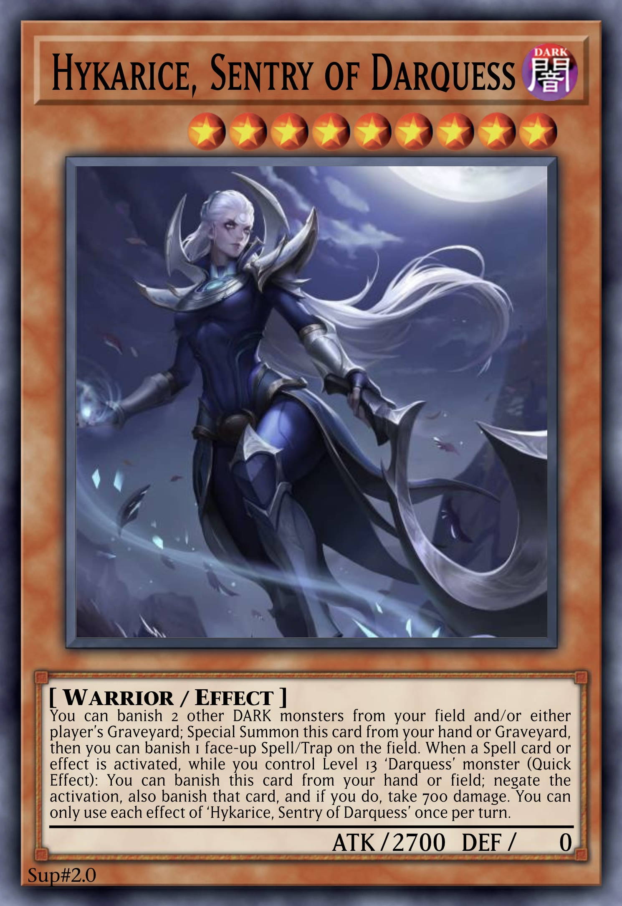

# Darquess

An archetype of DARK and protively Spellcaster monsters, focusing on Ritual and Fusion Summoning through the unique Ritual and Fusion Spell [Darquess Rising](../cards/spells/ritual/Darquess%20Rising.md), as well as banishing cards and dealing damage to the player. All monsters have 0 DEF, with the lower Level monsters searching out the other cards in the archetype, and the higher Level monsters acting as powerful counters and floodgates.

 

## Overview

### Level 4
The 3 Level 4 monsters have 1900 ATK and share the following effect, which can be used any number of times each turn.

> If another card is banished (even during the Damage Step): You can Special Summon this card from your hand or Graveyard, or add this banished card to your hand.

Additionally, each has an effect to search another card upon being Summoned, which also deals damage to the player.

> If this card is Summoned: You can [...], and if you do, take 700 damage.

<table>
  <tr>
    <th width="50px"> monster </th>
    <td align="center"> Aiza </td>
    <td align="center"> Azia </td>
    <td align="center"> Zaia </td>
  </tr>
  <tr>
    <th> card </th>
    <td align="center">  </td>
    <td align="center">  </td>
    <td align="center">  </td>
  </tr>
  <tr>
    <th> effect </th>
    <td> banish a ‘Darquess’ Spell/Trap from the Deck </td>
    <td> Set a banished ‘Darquess’ Spell/Trap </td>
    <td> mill a ‘Darquess’ monster </td>
  </tr>
</table>

### Level 7
This self-dealt damage allows the 3 Level 7 monsters to be Summoned, which have 2300 ATK.

> If either player takes damage (even during the Damage Step): You can Special Summon this card from your hand or Graveyard, and if you do, you can increase this card’s Level by 1 for every 100 damage taken.

Upon being Summoned, each has a specialyzed form of removal.

> If this card is Summoned: You can banish 1 [...].

Each also has an effect to search a Ritual-related card by banishing a card from the hand or Graveyard.

> You can banish 1 card from your hand or Graveyard; add 1 ‘Darquess’ [...] from your Deck or Banished Pile to your hand.

<table>
  <tr>
    <th width="50px"> monster </th>
    <td align="center"> Cythris </td>
    <td align="center"> Lyfris </td>
    <td align="center"> Syndris </td>
  </tr>
  <tr>
    <th> card </th>
    <td align="center">  </td>
    <td align="center">  </td>
    <td align="center">  </td>
  </tr>
  <tr>
    <th> banish </th>
    <td> face-up Spell/Trap </td>
    <td> face-down Spell/Trap </td>
    <td> opponent’s hand </td>
  </tr>
  <tr>
    <th> search </th>
    <td> Spell </td>
    <td> monster </td>
    <td> Ritual monster or Spell </td>
  </tr>
</table>

### Level 9
The 3 Level 9 monsters have 2700 ATK, and serve as powerful interrupts or sacrifices for Ritual Summons.

<table>
  <tr>
    <th width="50px"> monster </th>
    <td align="center"> Hykarice </td>
    <td align="center"> Kyralice </td>
    <td align="center"> Vyktica </td>
  </tr>
  <tr>
    <th> card </th>
    <td align="center">  </td>
    <td align="center">  </td>
    <td align="center">  </td>
  </tr>
  <tr>
    <th> interrupt </th>
    <td> negate Spell </td>
    <td> negate Trap </td>
    <td> banish monster </td>
  </tr>
</table>

### Level 13 Ritual
The 3 Ritual monsters are each Level 13 with 3000 ATK, sharing the following effects.

> Must be Ritual Summoned by a ‘Darquess’ card. If this card is Ritual Summoned: You can Set 1 ‘Darquess’ Trap from your Deck.

Each monster then has a continuous floodgate effect, an ignition effect involving banishing, and a non-activated effect.

<table>
  <tr>
    <th width="50px"> monster </th>
    <td align="center"> Raiza </td>
    <td align="center"> Laiza </td>
    <td align="center"> Vaiza </td>
  </tr>
  <tr>
    <th> card </th>
    <td>  </td>
    <td>  </td>
    <td>  </td>
  </tr>
  <tr>
    <th> continuous </th>
    <td> neither player can Normal Summon non-DARK monsters </td>
    <td> neither player can Special Summon non-DARK monsters from the Extra Deck </td>
    <td> DARK monsters lose ATK equal to their original DEF </td>
  </tr>
  <tr>
    <th> ignition </th>
    <td> banish 1 DARK monster from either player’s field or Graveyard </td>
    <td> Special Summon 1 banished DARK monster </td>
    <td> banish 1 random card from opponent’s hand </td>
  </tr>
  <tr>
    <th> other </th>
    <td> banish top card of opponent’s Deck face-down each time you take damage </td>
    <td> inflict 350 damage each time a card is banished </td>
    <td> ‘Darquess’ monsters can use effects as Quick Effects </td>
  </tr>
</table>

### Level 13 Fusion

### Spells
The archetypal Field Spell is [Realm of Darquess](../cards/spells/field/Realm%20of%20Darquess.md), which provides the critical conditions for the rest of the archetype to function effectively.

The archetypal Ritual Spell is [Darquess Rising](../cards/spells/ritual/Darquess%20Rising.md), which has both ATK and Level requirements.

<table>
  <tr>
    <th align="center"> Rising </th>
    <th align="center"> Realm </th>
  </tr>
  <tr>
    <td>  </td>
    <td>  </td>
  </tr>
</table>

 

## Cards

| type | count |
| :--- | :---- |
| Ritual | x3 |
| Fusion | x6 |

### Monsters

  
 <b> Main Deck </b> 
  

| card | Level | ATK/DEF | Type | Attribute |
| :--- | :---- | :------ | :--- | :-------- |
| [–](../cards/monsters/standard/–.md) | n ★★★★★★★★★★★★ | – / – | – | – |

  
 <b> Extra Deck </b> 
  

| card | Level | ATK/DEF | Type | Attribute | material |
| :--- | :---- | :------ | :--- | :-------- | :------- |
| [–](../cards/monsters/–/–.md) | n ★★★★★★★★★★★★ | – / – | – | – | – |

### Spells

  
 <b> display </b> 
  

| card | Type |
| :--- | :--- |
| [–](../cards/spells/–/–.md) | – |

### Traps

  
 <b> display </b> 
  

| card | Type |
| :--- | :--- |
| [–](../cards/traps/–/–.md) | – |

 

## Strategics

{...}

 

## Trivia

‘’ ◈ ⚡︎ ∞ ✦ ↵ ▯ ▮
