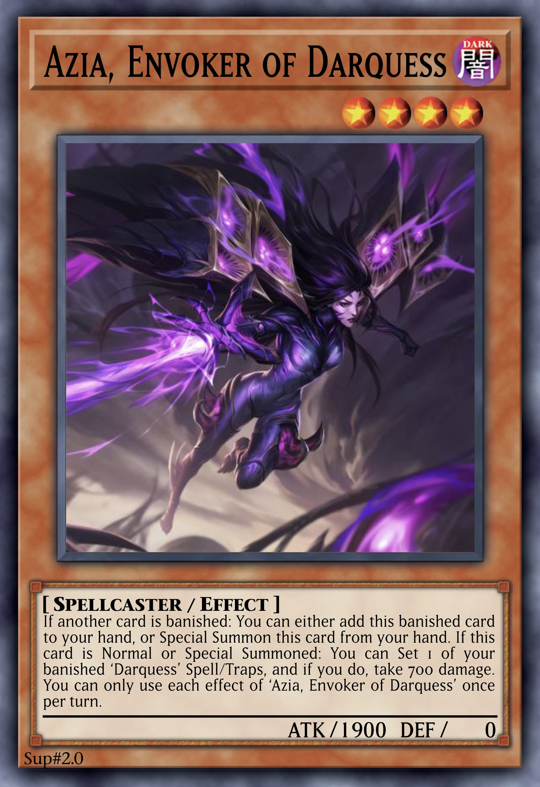
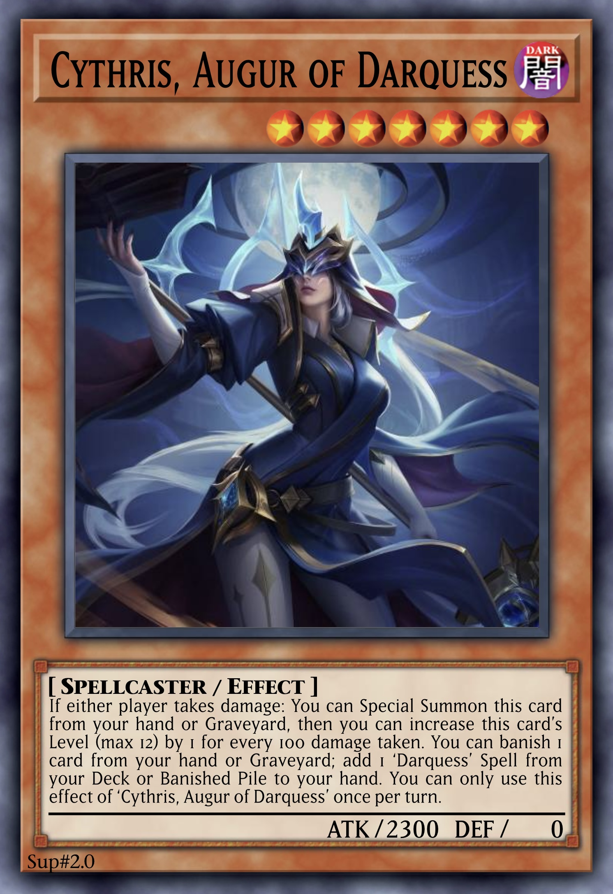

# Darquess

An archetype of DARK and protively Spellcaster monsters, focusing on Ritual and Fusion Summoning through the unique Ritual and Fusion Spell [Darquess Rising](../cards/spells/ritual/Darquess%20Rising.md), as well as banishing cards and dealing damage to the player themselves. All monsters have 0 DEF, with the lower Level monsters searching out the other cards in the archetype, and the higher Level monsters acting as powerful counters and floodgates.

 

## Overview

### Level 4
The 3 Level 4 monsters have 1900 ATK and share the following effect, which can be used any number of times each turn.

> If another card is banished (even during the Damage Step): You can Special Summon this card from your hand or Graveyard, or add this banished card to your hand.

Additionally, each has an effect to search another card upon being Summoned, which also deals damage to the player themselves.

> If this card is Summoned: You can [...], and if you do, take 700 damage.

<table>
  <tr>
    <th width="42px"> monster </th>
    <td align="center"> Aiza </td>
    <td align="center"> Azia </td>
    <td align="center"> Zaia </td>
  </tr>
  <tr>
    <th> card </th>
    <td align="center">  </td>
    <td align="center">  </td>
    <td align="center">  </td>
  </tr>
  <tr>
    <th> effect </th>
    <td> banish a ‘Darquess’ Spell/Trap from the Deck </td>
    <td> Set a banished ‘Darquess’ Spell/Trap </td>
    <td> mill a ‘Darquess’ monster </td>
  </tr>
</table>

### Level 7
This self-dealt damage allows the 3 Level 7 monsters to be Summoned, which each have 2300 ATK.

> If either player takes damage (even during the Damage Step): You can Special Summon this card from your hand or Graveyard, and if you do, you can increase this card’s Level by 1 for every 100 damage taken.

Upon being Summoned, each has a specialyzed form of removal:

> If this card is Summoned: You can banish 1 [...].

Each also has an effect to search a Ritual-related card by banishing a card from the hand or Graveyard.

> You can banish 1 card from your hand or Graveyard; add 1 ‘Darquess’ [...] from your Deck or Banished Pile to your hand.

<table>
  <tr>
    <th width="42px"> monster </th>
    <td align="center"> Cythris </td>
    <td align="center"> Lyfris </td>
    <td align="center"> Syndris </td>
  </tr>
  <tr>
    <th> card </th>
    <td align="center">  </td>
    <td align="center">  </td>
    <td align="center">  </td>
  </tr>
  <tr>
    <th> banish </th>
    <td> face-up Spell/Trap </td>
    <td> face-down Spell/Trap </td>
    <td> opponent’s hand </td>
  </tr>
  <tr>
    <th> search </th>
    <td> Spell </td>
    <td> monster </td>
    <td> Ritual monster or Spell </td>
  </tr>
</table>

### Level 9
The 3 Level 9 monsters have 2700 ATK, and serve as powerful interrupts or sacrifices for Ritual Summons.

Hykarice and Kyralice share the following effects:

> You can Special Summon this card (from your hand or Graveyard) by banishing 2 DARK monsters from your field and/or either player’s Graveyard.

> When a [Spell/Trap] card or effect is activated (Quick Effect): You can banish this card from your hand or field; negate that effect, also banish that card.

> If another ‘Darquess’ monster leaves the field: You can add this banished card to your hand, and if you do, take 700 damage.

Vyktica is slightly different, instead being able to Tribute an opponent’s monster, but can only banish itself from the field to banish another monster (without negating), and only retrieves itself when an ace monster leaves the field.

<table>
  <tr>
    <th width="42px"> monster </th>
    <td align="center"> Hykarice </td>
    <td align="center"> Kyralice </td>
    <td align="center"> Vyktica </td>
  </tr>
  <tr>
    <th> card </th>
    <td align="center">  </td>
    <td align="center">  </td>
    <td align="center">  </td>
  </tr>
  <tr>
    <th> interrupt </th>
    <td> negate Spell </td>
    <td> negate Trap </td>
    <td> banish monster </td>
  </tr>
</table>

### Level 13 Ritual
The 3 Ritual monsters are each Level 13 with 3000 ATK, sharing the following effects:

> Must be Ritual Summoned by a ‘Darquess’ card. If this card is Ritual Summoned: You can Set 1 ‘Darquess’ Trap from your Deck.

Each monster then has a continuous floodgate effect, an ignition effect involving banishing, and a non-activated effect.

<table>
  <tr>
    <th width="42px"> monster </th>
    <td align="center"> Raiza </td>
    <td align="center"> Laiza </td>
    <td align="center"> Vaiza </td>
  </tr>
  <tr>
    <th> card </th>
    <td>  </td>
    <td>  </td>
    <td>  </td>
  </tr>
  <tr>
    <th> continuous </th>
    <td> neither player can Normal Summon non-DARK monsters </td>
    <td> neither player can Special Summon non-DARK monsters from the Extra Deck </td>
    <td> DARK monsters lose ATK equal to their original DEF </td>
  </tr>
  <tr>
    <th> ignition </th>
    <td> banish 1 DARK monster from either player’s field or Graveyard </td>
    <td> Special Summon 1 banished DARK monster </td>
    <td> banish 1 random card from opponent’s hand </td>
  </tr>
  <tr>
    <th> other </th>
    <td> banish top card of opponent’s Deck face-down each time you take damage </td>
    <td> inflict 350 damage each time a card is banished </td>
    <td> ‘Darquess’ monsters can use effects as Quick Effects </td>
  </tr>
</table>

### Level 13 Fusion
The 3 main Level 13 Fusion monsters each have 3300 ATK, requiring 2 of the 3 Ritual monsters as material. They feature a powerful floodgate effect of their own, while sharing the following effect:

> If this card is targeted for an attack or by a card effect (Quick Effect): You can make 1 other DARK monster on the field become the target instead.

<table>
  <tr>
    <th width="42px"> monster </th>
    <td align="center"> Elaiza </td>
    <td align="center"> Levaiza </td>
    <td align="center"> Vraiza </td>
  </tr>
  <tr>
    <th> card </th>
    <td>  </td>
    <td>  </td>
    <td>  </td>
  </tr>
  <tr>
    <th> continuous </th>
    <td> neither player can Summon non-DARK monsters </td>
    <td> your opponent can only Summon monsters in Defence Position, and monsters they control in Defence Position cannot activate effects </td>
    <td> negates the effects of Synchro, Xyz, and Link monsters on the field and in the Graveyard </td>
  </tr>
</table>

### Spells
The archetypal Field Spell is [Realm of Darquess](../cards/spells/field/Realm%20of%20Darquess.md), which provides the critical conditions for the rest of the archetype to function effectively.

The archetypal Ritual and Fusion Spell is [Darquess Rising](../cards/spells/ritual/Darquess%20Rising.md), which can both be used to Ritual Summon the Main Deck Ritual monsters, or Fusion Summon the Extra Deck Fusion monsters.

<table>
  <tr>
    <th align="center"> Rising </th>
    <th align="center"> Realm </th>
  </tr>
  <tr>
    <td>  </td>
    <td>  </td>
  </tr>
</table>

### Traps
Many opening and searching cards that would usually be Spells are instead Traps, some of which have the ability to be activated from the hand by taking damage. Most important of all are the 2 monster and Spell/Trap searchers, [Awakening of Darquess]() and [Runes of Darquess](), which can also search the Field Spell if it is not already active.

<table>
  <tr>
    <th align="center"> Awakening </th>
    <th align="center"> Runes </th>
  </tr>
  <tr>
    <td>  </td>
    <td>  </td>
  </tr>
</table>

Otherwise of note are the 4 Continuous Traps, which provide the Ritual monsters with protection or hinder the opponent, while either damaging the opponent or recovering life points. They also have the useful effect to recover another banished ‘Darquess’ Spell/Trap when banished themselves, allowing for efficient recycling or excellent banish targets.

<table>
  <tr>
    <th width="42px"> Trap </th>
    <th align="center"> Magnificence </th>
    <th align="center"> Perfection </th>
    <th align="center"> Corruption </th>
    <th align="center"> Nightmare </th>
  </tr>
  <tr>
    <th> card </th>
    <td>  </td>
    <td>  </td>
    <td>  </td>
    <td>  </td>
  </tr>
  <tr>
    <th> effect </th>
    <td> battle and monster effect destruction </td>
    <td> Spell/Trap effects </td>
    <td> opponent’s monsters’ names become <em>Corrupted of Darquess</em> </td>
    <td> opponent skips their Main Phase 1 </td>
  </tr>
  <tr>
    <th> other </th>
    <td> +350 LP each time your opponent places a card on the field </td>
    <td> +350 LP each time your opponent activates a card effect </td>
    <td> inflict 350 damage each time your opponent activates a card effect </td>
    <td> inflict 350 damage each time your opponent places a card on the field </td>
  </tr>
</table>

 

## Cards

| type | count |
| :--- | :---- |
| Ritual | x3 |
| Fusion | x6 |

### Monsters

  
 <b> Main Deck </b> 
  

| card | Level | ATK/DEF | Type |
| :--- | :---- | :------ | :--- |
| [Aiza, Invoker of Darquess](../cards/monsters/standard/–.md) | 4 ★★★★ | 1900 / 0 | – |
| [Azia, Envoker of Darquess](../cards/monsters/standard/–.md) | 4 ★★★★ | 1900 / 0 | – |
| [Zaia, Evoker of Darquess](../cards/monsters/standard/–.md) | 4 ★★★★ | 1900 / 0 | – |
| [Cythris, Augur of Darquess](../cards/monsters/standard/–.md) | 7 ★★★★★★★ | 2300 / 0 | – |
| [Lyfris, Herald of Darquess](../cards/monsters/standard/–.md) | 7 ★★★★★★★ | 2300 / 0 | – |
| [Syndris, Oracle of Darquess](../cards/monsters/standard/–.md) | 7 ★★★★★★★ | 2300 / 0 | – |
| [Hykarice, Sentry of Darquess](../cards/monsters/standard/–.md) | 9 ★★★★★★★★★ | 2700 / 0 | – |
| [Kyralice, Sentinel of Darquess](../cards/monsters/standard/–.md) | 9 ★★★★★★★★★ | 2700 / 0 | – |
| [Vyktica, Valkyrie of Darquess](../cards/monsters/standard/–.md) | 9 ★★★★★★★★★ | 2700 / 0 | – |
| [Raiza, Sorceress of Darquess](../cards/monsters/ritual/Raiza.md) | 13 ★★★★★★★★★★★★★ | 3000 / 0 | Ritual |
| [Laiza, Enchantress of Darquess](../cards/monsters/ritual/Laiza.md) | 13 ★★★★★★★★★★★★★ | 3000 / 0 | Ritual |
| [Vaiza, Empress of Darquess](../cards/monsters/ritual/Vaiza.md) | 13 ★★★★★★★★★★★★★ | 3000 / 0 | Ritual |
| [Dyavin, Devoter of Darquess](../cards/monsters/standard/–.md) | 6 ★★★★★★ | 1500 / 0 | – |

  
 <b> Extra Deck </b> 
  

| card | Level | ATK/DEF | Type | material |
| :--- | :---- | :------ | :--- | :------- |
| [Elaiza, Arisen of Darquess](../cards/monsters/fusion/–.md) | 13 ★★★★★★★★★★★★★ | 3300 / 0 | Fusion | *Laiza, Enchantress of Darquess* + *Raiza, Sorceress of Darquess* |
| [Levaiza, Ascended of Darquess](../cards/monsters/fusion/–.md) | 13 ★★★★★★★★★★★★★ | 3300 / 0 | Fusion | *Vaiza, Empress of Darquess* + *Laiza, Enchantress of Darquess* |
| [Vraiza, Awakened of Darquess](../cards/monsters/fusion/–.md) | 13 ★★★★★★★★★★★★★ | 3300 / 0 | Fusion | *Raiza, Sorceress of Darquess* + *Vaiza, Empress of Darquess* |
| [Primordial Darquessence, Oblivion of Darquess](../cards/monsters/fusion/Primordial%20Darquessence.md) | 13 ★★★★★★★★★★★★★ | ? / 0 | Fusion | 3 Level 13 ‘Darquess’ monsters |
| [Lynuca, Silencer of Darquess](../cards/monsters/fusion/–.md) | 11 ★★★★★★★★★★★ | 2700 / 0 | Fusion | 2 Level 7 or higher DARK monsters |
| [Dyvarice, Corruptor of Darquess](../cards/monsters/fusion/–.md) | 9 ★★★★★★★★★ | 2700 / 0 | Fusion | 2 DARK monsters |

### Spells

  
 <b> display </b> 
  

| card | Type |
| :--- | :--- |
| [Allure of Darquess](../cards/spells/–/–.md) | |
| [Coven of Darquess](../cards/spells/–/–.md) | ∞ Continuous |
| [Prophecy of Darquess](../cards/spells/–/–.md) | |
| [Darquess Rising](../cards/spells/ritual/Darquess%20Rising.md) | ◈ Ritual |
| [Realm of Darquess](../cards/spells/field/Realm%20of%20Darquess.md) | ✦ Field |
| [Rites of Darquess](../cards/spells/–/–.md) | |
| [Temptation of Darquess](../cards/spells/–/–.md) | |
| [–](../cards/spells/–/–.md) | – |

### Traps

  
 <b> display </b> 
  

| card | Type |
| :--- | :--- |
| [–](../cards/traps/–/–.md) | – |

 

## Strategics

{...}

 

## Trivia

‘’ ◈ ⚡︎ ∞ ✦ ↵ ▯ ▮
