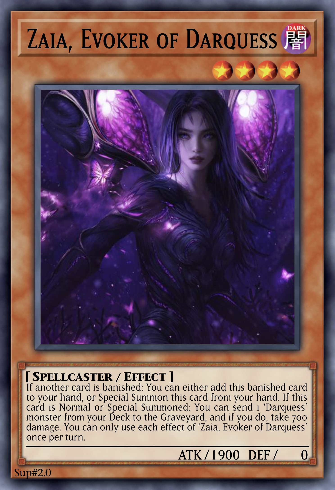
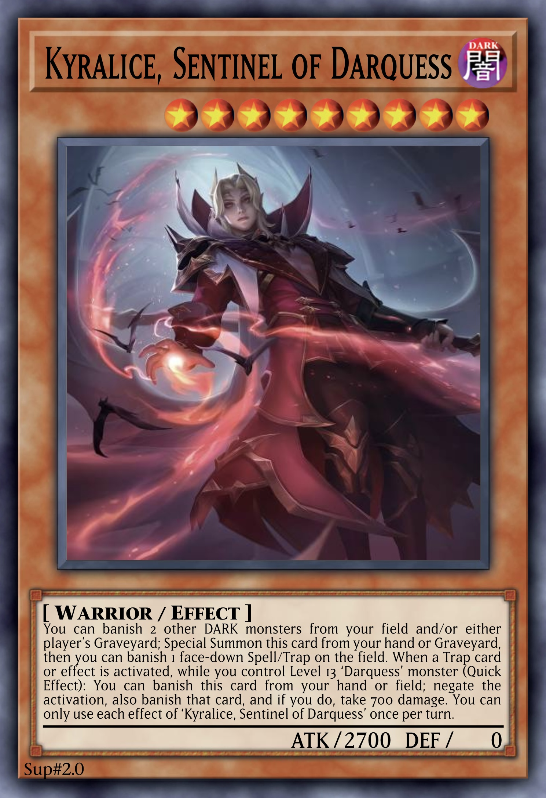
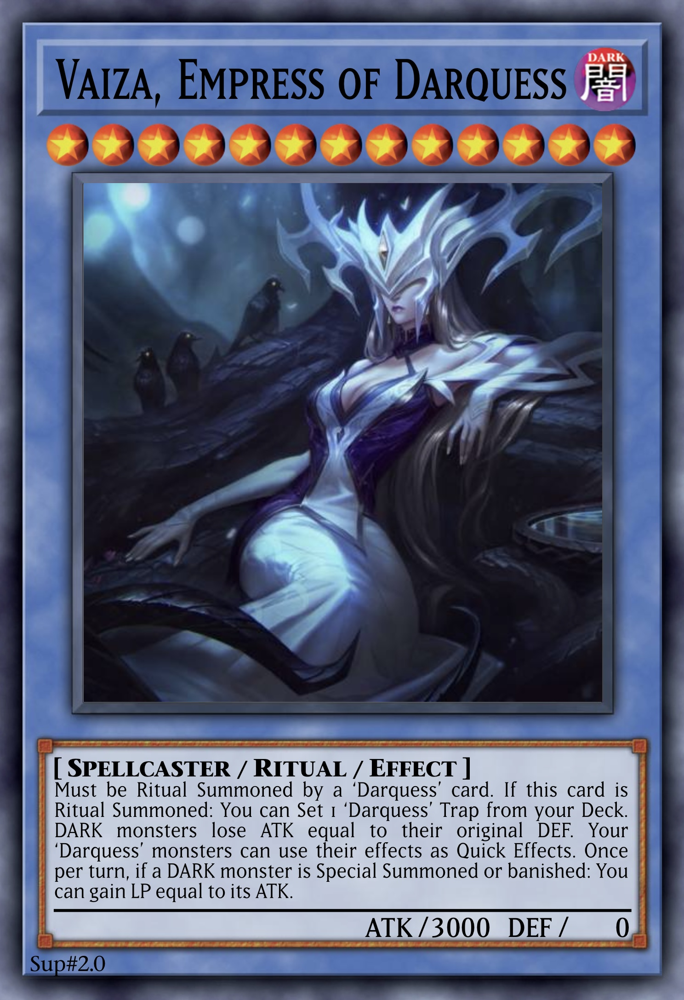
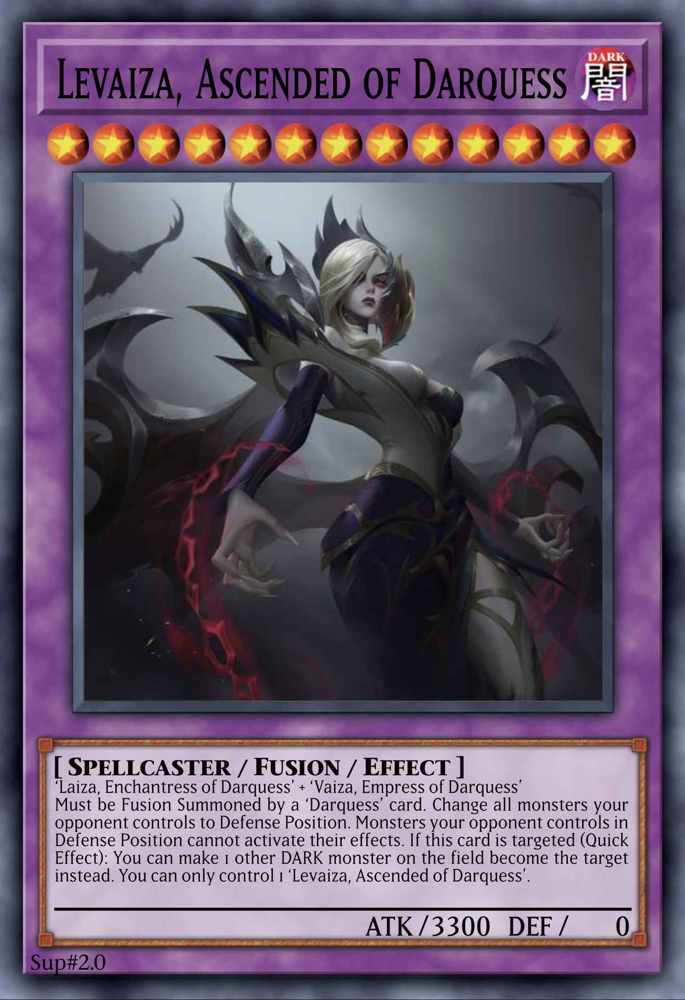

# Darquess

An archetype of DARK and primarily Spellcaster Monsters, harnessing Ritual and Fusion Summoning through the unique Ritual and Fusion Spell [Darquess Rising](../cards/spells/ritual/Darquess%20Rising.md), revolving around banishing cards and dealing damage to the player themselves.

 

## Cards

| type | count |
| :--- | :---- |
| Ritual | x3 |
| Fusion | x6 |

### Monsters

  
 <b> Main Deck </b> 
  

| card | Level | ATK/DEF | Type |
| :--- | :---- | :------ | :--- |
| [Aiza, Invoker of Darquess](../cards/monsters/standard/–.md) | 4 ★★★★ | 1900 / 0 | |
| [Azia, Envoker of Darquess](../cards/monsters/standard/–.md) | 4 ★★★★ | 1900 / 0 | |
| [Zaia, Evoker of Darquess](../cards/monsters/standard/–.md) | 4 ★★★★ | 1900 / 0 | |
| [Cythris, Augur of Darquess](../cards/monsters/standard/–.md) | 7 ★★★★★★★ | 2300 / 0 | |
| [Lyfris, Herald of Darquess](../cards/monsters/standard/–.md) | 7 ★★★★★★★ | 2300 / 0 | |
| [Syndris, Oracle of Darquess](../cards/monsters/standard/–.md) | 7 ★★★★★★★ | 2300 / 0 | |
| [Hykarice, Sentry of Darquess](../cards/monsters/standard/–.md) | 9 ★★★★★★★★★ | 2700 / 0 | |
| [Kyralice, Sentinel of Darquess](../cards/monsters/standard/–.md) | 9 ★★★★★★★★★ | 2700 / 0 | |
| [Vyktica, Valkyrie of Darquess](../cards/monsters/standard/–.md) | 9 ★★★★★★★★★ | 2700 / 0 | |
| [Raiza, Sorceress of Darquess](../cards/monsters/ritual/Raiza.md) | 13 ★★★★★★★★★★★★★ | 3000 / 0 | Ritual |
| [Laiza, Enchantress of Darquess](../cards/monsters/ritual/Laiza.md) | 13 ★★★★★★★★★★★★★ | 3000 / 0 | Ritual |
| [Vaiza, Empress of Darquess](../cards/monsters/ritual/Vaiza.md) | 13 ★★★★★★★★★★★★★ | 3000 / 0 | Ritual |
| [Kes, Fallen of Darquess](../cards/monsters/standard/–.md) | 6 ★★★★★★ | 1500 / 0 | |
| [Dyavin, Devoter of Darquess](../cards/monsters/standard/–.md) | 6 ★★★★★★ | 1500 / 0 | Tuner |

  
 <b> Extra Deck </b> 
  

| card | Level | ATK/DEF | Type | Material |
| :--- | :---- | :------ | :--- | :------- |
| [Elaiza, Arisen of Darquess](../cards/monsters/fusion/–.md) | 13 ★★★★★★★★★★★★★ | 3300 / 0 | Fusion | *Raiza, Sorceress of Darquess* + *Laiza, Enchantress of Darquess* |
| [Levaiza, Ascended of Darquess](../cards/monsters/fusion/–.md) | 13 ★★★★★★★★★★★★★ | 3300 / 0 | Fusion | *Laiza, Enchantress of Darquess* + *Vaiza, Empress of Darquess* |
| [Vraiza, Awakened of Darquess](../cards/monsters/fusion/–.md) | 13 ★★★★★★★★★★★★★ | 3300 / 0 | Fusion | *Vaiza, Empress of Darquess* + *Raiza, Sorceress of Darquess* |
| [Primordial Darquessence, Oblivion of Darquess](../cards/monsters/fusion/Primordial%20Darquessence.md) | 13 ★★★★★★★★★★★★★ | ? / 0 | Fusion | 3 Level 13 ‘Darquess’ Monsters with different names |
| [Lynuca, Silencer of Darquess](../cards/monsters/fusion/–.md) | 11 ★★★★★★★★★★★ | 2700 / 0 | Fusion | 2 Level 9+ DARK Monsters |
| [Dyvarice, Corruptor of Darquess](../cards/monsters/fusion/–.md) | 9 ★★★★★★★★★ | 2700 / 0 | Fusion | 2 DARK Monsters with different types (Ritual/Fusion/Synchro/Xyz/Link) |

### Spells

  
 <b> display </b> 
  

| card | Type |
| :--- | :--- |
| [Allure of Darquess](../cards/spells/–/–.md) | |
| [Covin of Darquess](../cards/spells/–/–.md) | ∞ Continuous |
| [Darquess Rising](../cards/spells/ritual/Darquess%20Rising.md) | ◈ Ritual |
| [Prophecy of Darquess](../cards/spells/–/–.md) | |
| [Realm of Darquess](../cards/spells/field/Realm%20of%20Darquess.md) | ✦ Field |
| [Rites of Darquess](../cards/spells/–/–.md) | |
| [Temptation of Darquess](../cards/spells/–/–.md) | |

### Traps

  
 <b> display </b> 
  

| card | Type |
| :--- | :--- |
| [Awakening of Darquess](../cards/traps/–/–.md) | |
| [Corruption of Darquess](../cards/traps/–/–.md) | |
| [Darquess Falling](../cards/traps/–/–.md) | ↵ Counter |
| [Magnificence of Darquess](../cards/traps/–/–.md) | ∞ Continuous |
| [Nightmare of Darquess](../cards/traps/–/–.md) | ∞ Continuous |
| [Perfection of Darquess](../cards/traps/–/–.md) | ∞ Continuous |
| [Revenge of Darquess](../cards/traps/–/–.md) | ↵ Counter |
| [Runes of Darquess](../cards/traps/–/–.md) | |
| [Seduction of Darquess](../cards/traps/–/–.md) | |
| [Soul of Darquess](../cards/traps/–/–.md) | ↵ Counter |

 

## Overview

All Monsters have 0 DEF.

### Level 4
The 3 Level 4 Monsters have 1900 ATK and share the following effect:

> If another card is banished: You can either add this banished card to your hand, or Special Summon this card from your hand.

Each has an effect to search another card on Summon, which also deals damage to the player themselves:

> If this card is Normal or Special Summoned: You can {...}, and if you do, take 700 damage.

<table>
  <tr>
    <th width="42px"> Monster </th>
    <td align="center"> Aiza </td>
    <td align="center"> Azia </td>
    <td align="center"> Zaia </td>
  </tr>
  <tr>
    <th> card </th>
    <td align="center">  </td>
    <td align="center">  </td>
    <td align="center">  </td>
  </tr>
  <tr>
    <th> effect </th>
    <td> banish a ‘Darquess’ Spell/Trap from Deck </td>
    <td> Set a banished ‘Darquess’ Spell/Trap </td>
    <td> bury a ‘Darquess’ Monster </td>
  </tr>
</table>

### Level 7
This self-dealt damage allows the 3 Level 7 Monsters to be Summoned, which each have 2300 ATK.

> If either player takes damage: You can Special Summon this card from your hand or Graveyard, then you can increase this card’s Level (max 12) by 1 for every 100 damage taken.

They can then banish a card from the hand or Grave to search a Ritual-related card:

> You can banish 1 card from your hand or Graveyard; add 1 ‘Darquess’ {...} from your Deck or Banished Pile to your hand.

<table>
  <tr>
    <th width="42px"> Monster </th>
    <td align="center"> Cythris </td>
    <td align="center"> Lyfris </td>
    <td align="center"> Syndris </td>
  </tr>
  <tr>
    <th> card </th>
    <td align="center">  </td>
    <td align="center">  </td>
    <td align="center">  </td>
  </tr>
  <tr>
    <th> search </th>
    <td> ‘Darquess’ Spell </td>
    <td> ‘Darquess’ Monster </td>
    <td> ‘Darquess’ Ritual card </td>
  </tr>
</table>

### Level 9
The 3 Level 9 Monsters have 2700 ATK, and serve as powerful removal, interrupts and sacrifices for Ritual Summons.

They share the following effects:

> You can banish 2 other DARK Monsters from your field and/or either player’s Graveyard; Special Summon this card from your hand or Graveyard, then you can banish 1 {...}.

Hykarice and Kyralice can negate Spell/Traps:

> When a {Spell/Trap} card or effect is activated, while you control a Level 13 ‘Darquess’ Monster (Quick Effect): You can banish this card from your hand or field; negate the activation, also banish that card, and if you do, take 700 damage.

Vyktica is slightly different:

> When a DARK Monster declares an attack or activates its effect, while you control a Level 13 ‘Darquess’ Monster (Quick Effect): You can banish this card from your hand or field; banish that monster, and if you do, take 700 damage.

<table>
  <tr>
    <th width="42px"> Monster </th>
    <td align="center"> Hykarice </td>
    <td align="center"> Kyralice </td>
    <td align="center"> Vyktica </td>
  </tr>
  <tr>
    <th> card </th>
    <td align="center">  </td>
    <td align="center">  </td>
    <td align="center">  </td>
  </tr>
  <tr>
    <th> banish </th>
    <td> faceup Spell/Trap </td>
    <td> facedown Spell/Trap </td>
    <td> Grave </td>
  </tr>
  <tr>
    <th> interrupt </th>
    <td> Spell </td>
    <td> Trap </td>
    <td> Monster </td>
  </tr>
</table>

### Level 13 Ritual
The 3 Ritual Monsters are each Level 13 with 3000 ATK. They share the Summoning and control conditions that they must be Ritual Summoned by a ‘Darquess’ card, and restrict the player to controlling only 1 of each. Upon Ritual Summon, they can each search any ‘Darquess’ Trap from the Deck.

> If this card is Ritual Summoned: You can Set 1 ‘Darquess’ Trap from your Deck.

Each then has a continuous floodgate effect, an ignition effect involving banishing, and a non-activated effect.

<table>
  <tr>
    <th width="42px"> Monster </th>
    <td align="center"> Raiza </td>
    <td align="center"> Laiza </td>
    <td align="center"> Vaiza </td>
  </tr>
  <tr>
    <th> card </th>
    <td>  </td>
    <td>  </td>
    <td>  </td>
  </tr>
  <tr>
    <th> continuous </th>
    <td> neither player can Normal Summon non-DARK Monsters </td>
    <td> neither player can Special Summon non-DARK Monsters from the Extra Deck </td>
    <td> DARK Monsters lose ATK equal to their original DEF </td>
  </tr>
  <tr>
    <th> ignition </th>
    <td> banish 1 DARK Monster from either player’s field or Grave </td>
    <td> Special Summon 1 banished DARK Monster </td>
    <td> gain LP equal to a DARK Monster’s ATK when it is banished or Summoned </td>
  </tr>
  <tr>
    <th> other </th>
    <td> banish top card of opponent’s Deck face-down each time you take damage </td>
    <td> inflict 350 damage each time a card is banished </td>
    <td> ‘Darquess’ Monsters can use effects as Quick Effects </td>
  </tr>
</table>

### Level 13 Fusion
The 3 main Level 13 Fusion Monsters each have 3300 ATK, requiring 2 of the 3 Ritual Monsters as Material. They feature a powerful floodgate effect of their own, while sharing the following effect:

> If this card is targeted (Quick Effect): You can make 1 other DARK Monster on the field become the target instead.

<table>
  <tr>
    <th width="42px"> Monster </th>
    <td align="center"> Elaiza </td>
    <td align="center"> Levaiza </td>
    <td align="center"> Vraiza </td>
  </tr>
  <tr>
    <th> card </th>
    <td>  </td>
    <td>  </td>
    <td>  </td>
  </tr>
  <tr>
    <th> continuous </th>
    <td> neither player can Normal or Special Summon non-DARK Monsters </td>
    <td> opponent can only Summon Monsters in Defence Position, and Monsters they control in Defence Position cannot activate effects </td>
    <td> negates the effects of DARK Synchro, Xyz, and Link Monsters </td>
  </tr>
</table>

### Spells
The archetypal Field Spell is [Realm of Darquess](../cards/spells/field/Realm%20of%20Darquess.md), which provides the critical conditions for the rest of the archetype to function effectively.

The archetypal Ritual and Fusion Spell is [Darquess Rising](../cards/spells/ritual/Darquess%20Rising.md), which can recover itself as long as it is banished.

<table>
  <tr>
    <th align="center"> Rising </th>
    <th align="center"> Realm </th>
  </tr>
  <tr>
    <td>  </td>
    <td>  </td>
  </tr>
</table>

### Traps
Many opening and searching cards that would usually be Spells are instead Traps, some of which have the ability to be activated immediately by taking damage. Most important of all are the Monster and Spell/Trap searchers, [Awakening of Darquess]() and [Runes of Darquess](), which can also search the Field Spell if it is not already active.

<table>
  <tr>
    <th align="center"> Awakening </th>
    <th align="center"> Runes </th>
  </tr>
  <tr>
    <td>  </td>
    <td>  </td>
  </tr>
</table>

Otherwise of note are the 3 Continuous Traps, which provide the Ritual Monsters with protection and recover LP that the player loses from all the self-damage. They also have the useful effect to recover another banished ‘Darquess’ Trap when banished themselves, allowing for efficient recursion.

<table>
  <tr>
    <th width="42px"> Trap </th>
    <th align="center"> Magnificence </th>
    <th align="center"> Perfection </th>
    <th align="center"> Nightmare </th>
  </tr>
  <tr>
    <th> card </th>
    <td>  </td>
    <td>  </td>
    <td>  </td>
  </tr>
  <tr>
    <th> continuous </th>
    <td> battle and Monster effect destruction </td>
    <td> Spell/Trap effects </td>
    <td> opponent skips their Main Phase 1 </td>
  </tr>
  <tr>
    <th> LP </th>
    <td> gain 350 LP each time opponent activates a card or effect </td>
    <td> gain 350 LP each time opponent places a card on the field </td>
    <td> inflict 350 damage each time opponent activates a card or effect </td>
  </tr>
</table>

 

## Strategics

{...}

 

## Trivia

- This entire archetype was born from [Raiza](../cards/monsters/ritual/Raiza.md), a childhood card I created.
- The archetype features many triplets of cards.
  - There are 3 Monsters for each class – Lv4, Lv7, Lv9, Lv13 Ritual and Lv13 Fusion.
  - There are 3 Continuous Traps.
- Within each triplet, there also tends to be a card slightly different from the rest.
  - Lv4 – Zaia searches another Monster instead of Spell/Traps.
  - Lv7 – Syndris searches a Ritual card instead of any Monster or Spell.
  - Lv9 – Vyktica only banishes without negating.
  - Lv13 Ritual – Vaiza has no ignition effect, instead turning the other Ritual Monsters far deadlier.
  - Continuous Traps – Nightmare inflicts damage instead of gaining LP, and hinders the opponent instead of protecting the Ritual Monsters.
