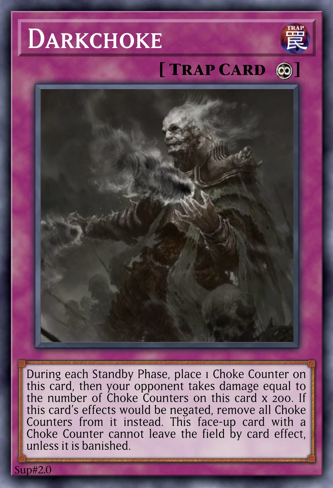

# Staples

A series of custom staple cards, many parodies of existing cards.

 

## Cards

| type | count |
| :--- | :---- |
| Monster | x2 |
| Spell   | x |
| Trap    | x7 |

### Monsters

  
 <b> Main Deck </b> 
  

| card | Level | ATK/DEF | Type | Attribute |
| :--- | :---- | :------ | :--- | :-------- |
| [Bloody Blossoms of the Afterlife](../cards/monsters/standard/Bloody%20Blossoms%20of%20the%20Afterlife.md) | 0 | 0 / 0 | Illusionist Tuner | DARK |
| [Bloody Blossoms of the Afterworld](../cards/monsters/standard/Bloody%20Blossoms%20of%20the%20Afterworld.md) | 0 | 0 / 0 | Illusionist Tuner | DARK |

  
 <b> Extra Deck </b> 
  

| card | Level/Rank/Link | ATK/DEF | Type | Attribute | Material |
| :--- | :-------------- | :------ | :--- | :-------- | :------- |
| [–](../cards/monsters/–/–.md) | n ★★★★★★★★★★★★ | – / – | – | – | – |

### Spells

  
 <b> display </b> 
  

| card | property |
| :--- | :------- |
| [Atrocious Fusion](../cards/spells/Atrocious%20Fusion.md) | ⚡︎ Quick |
| [Final Vanquish](../cards/spells/Final%20Vanquish.md) | |
| [Foolish Burial Trade](../cards/spells/Foolish%20Burial%20Trade.md) | |
| [Foolish Exile](../cards/spells/Foolish%20Exile.md) | |
| [Hybrid Polymerization](../cards/spells/Hybrid%20Polymerization.md) | ⚡︎ Quick |
| [Instant Draw](../cards/spells/Instant%20Draw.md) | ⚡︎ Quick |
| [It's In The Name](../cards/spells/It's%20In%20The%20Name.md) | |
| [Quick Polymerization](../cards/spells/Quick%20Polymerization.md) | ⚡︎ Quick |
| [Quickdraw Summon](../cards/spells/Quickdraw%20Summon.md) | ⚡︎ Quick |
| [Rakurai](../cards/spells/Rakurai.md) | |
| [That Grass Looks Darker](../cards/spells/That%20Grass%20Looks%20Darker.md) | |

### Traps

  
 <b> display </b> 
  

| card | property |
| :--- | :------- |
| [Awakening the Drakon](../cards/traps/Awakening%20the%20Drakon.md) | |
| [Darkchoke](../cards/traps/Darkchoke.md) | ∞ Continuous |
| [Infinite Impertinence](../cards/traps/Infinite%20Impertinence.md) | |
| [Solemn Silence](../cards/traps/Solemn%20Silence.md) | ↵ Counter |
| [Terrorforming](../cards/traps/Terrorforming.md) | |
| [Tormenting Trap Hole](../cards/traps/Tormenting%20Trap%20Hole.md) | |
| [Victory in Vengeance](../cards/traps/Victory%20in%20Vengeance.md) | ↵ Counter |

 

## Deck

> Last updated: June 2023

### Tips
- View the deck on [DuelingBook](https://duelingbook.com/deck?id=12239205)!
- Hover over a card to view its card text.

### Notes
- The cards are ordered in a logical order rather than by properties.
- Staples that only synergise with certain decks or playstyles have also been included.

  
 <b> display </b> 

### Main Deck

 

## Trivia
