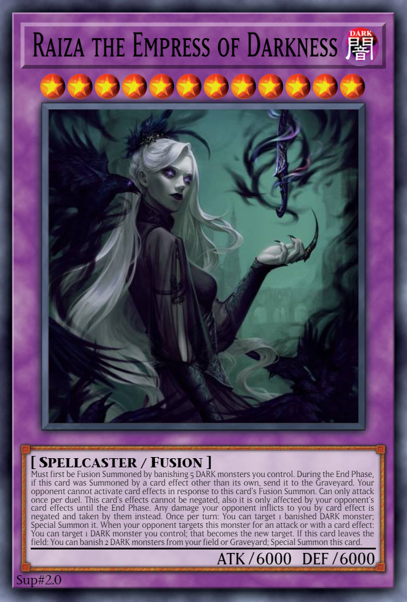

# Raiza the Empress of Darkness

{desc}

<table>
  <tr>
    <th colspan="3"> <h3> Raiza the Empress of Darkness </h3> </th>
  </tr>
  <tr>
    <td rowspan="7">  </td>
    <td> type </td>
    <td> monster </td>
  </tr>
  <tr>
    <td> archetype </td>
    <td> – </td>
  </tr>
  <tr>
    <td> Types </td>
    <td> Spellcaster / Fusion / Effect </td>
  </tr>
  <tr>
    <td> Attribute </td>
    <td> DARK </td>
  </tr>
  <tr>
    <td> Level </td>
    <td> 12 ★★★★★★★★★★★★ </td>
  </tr>
  <tr>
    <td> ATK / DEF </td>
    <td> 6000 / 6000 </td>
  </tr>
  <tr>
    <td> material </td>
    <td> 5 DARK monsters whose Levels total 20+ </td>
  </tr>
</table>

 

## Effects

Must first be Fusion Summoned by banishing the above materials you control (You do not use 'Polymerization'). During the End Phase, if this card was Summoned by a card effect other than its own, send it to the Graveyard. Your opponent cannot activate card effects in response to this card's Fusion Summon. Can only attack once per Duel. This card's effects cannot be negated, also it is only affected by your opponent's card effects until the End Phase. Any damage your opponent inflicts to you by card effect is negated and taken by them instead. Once per turn: You can target 1 banished DARK monster; Special Summon it. When your opponent targets this monster for an attack or with a card effect: You can target other 1 DARK monster you control; that becomes the new target. If this card leaves the field: You can banish 2 DARK monsters from your field or Graveyard; Special Summon this card.
