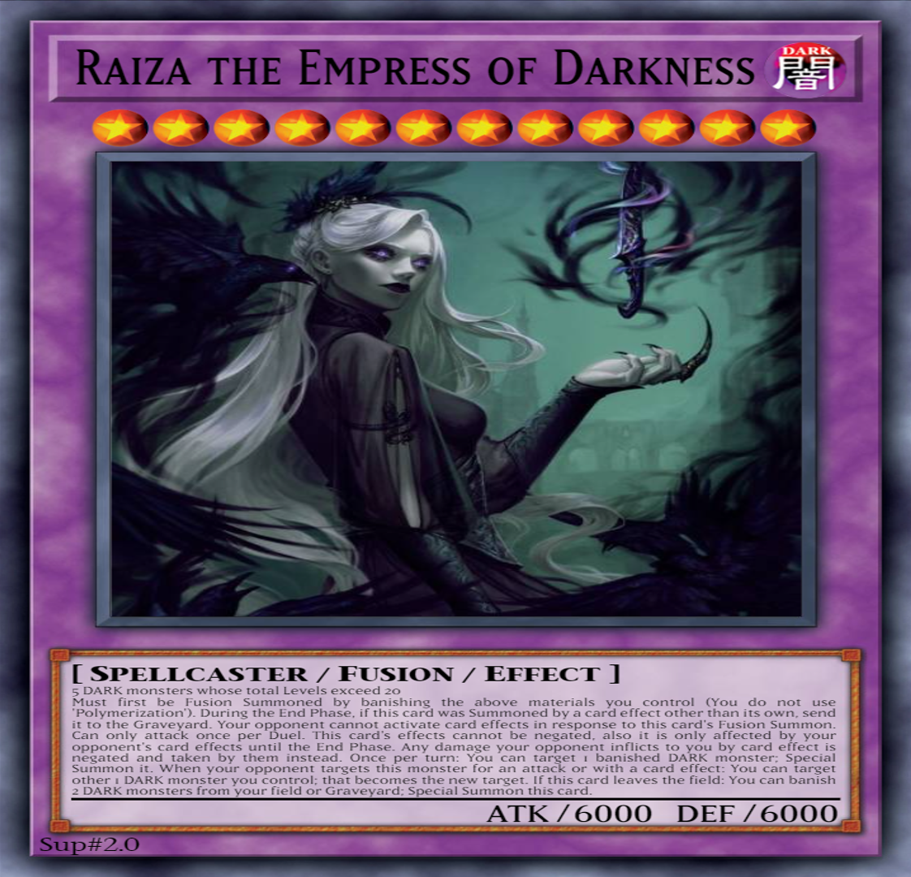

# Raiza the Empress of Darkness

{desc}

<table>
  <tr>
    <th colspan="3"> <h3> Raiza the Empress of Darkness </h3> </th>
  </tr>
  <tr>
    <td rowspan="8">  </td>
    <td> type </td>
    <td> monster </td>
  </tr>
  <tr>
    <td> archetype </td>
    <td> – </td>
  </tr>
  <tr>
    <td> Types </td>
    <td> Spellcaster / Fusion </td>
  </tr>
  <tr>
    <td> Attribute </td>
    <td> DARK </td>
  </tr>
  <tr>
    <td> Level </td>
    <td> 12 ★★★★★★★★★★★★ </td>
  </tr>
  <tr>
    <td> ATK / DEF </td>
    <td> 6000 / 6000 </td>
  </tr>
  <tr>
    <td> material </td>
    <td> 5 DARK monsters whose Levels total 20+ </td>
  </tr>
  <tr>
    <td> special </td>
    <td> material banish </td>
  </tr>
</table>

 

## Effects

| effect | type | notes |
| :----- | :--- | :---- |
| Must first be Fusion Summoned by banishing the above materials you control (You do not use ‘Polymerization’). | condition | |
| During the End Phase, if this card was Summoned by a card effect other than its own, send it to the Graveyard. | condition | This means it can only be Summoned from the Graveyard for 1 turn. |
| Your opponent cannot activate card effects in response to this card’s Fusion Summon. | condition | Its Summon cannot be negated or have effects chained to it. |
| Can only attack once per Duel. | condition | Only 1 6000 ATK hit. |
| This card’s effects cannot be negated, also it is only affected by your opponent’s card effects until the End Phase. | continuous | If it leaves the field by card effect, it is not Summoned again. |
| Any effect damage your opponent inflicts to you taken by them instead. | continuous | Don’t even think about inflicting its ATK as damage. |
| Once per turn: You can target 1 banished DARK monster; Special Summon it. | ignition | The monster can be from either player’s Graveyard. |
| When your opponent targets this monster for an attack or with a card effect: You can target other 1 DARK monster you control; that becomes the new target. | trigger | Can be used any number of times each turn, and during your opponent's turn. As long as you control another DARK monster, Raiza's got solid protection. |
| If this card leaves the field: You can banish 2 DARK monsters from your field or Graveyard; Special Summon this card. | trigger | Tough luck getting rid of it. |
