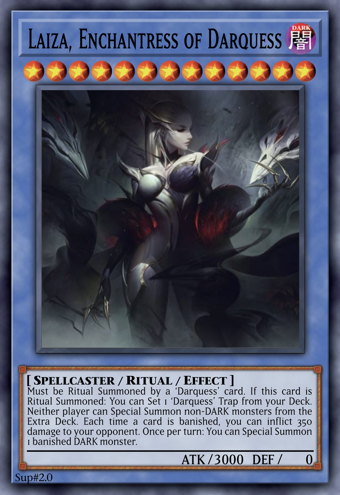

# Laiza, Enchantress of Darquess

<!-- {desc} -->

<table>
  <tr>
    <th colspan="3"> <h3> Laiza, Enchantress of Darquess </h3> </th>
  </tr>
  <tr>
    <td rowspan="8">  </td>
  </tr>
  <tr>
    <td> type </td>
    <td> Monster </td>
  </tr>
  <tr>
    <td> archetype </td>
    <td> <a href="../../../archetypes/Darquess.md">Darquess</a> </td>
  </tr>
  <tr>
    <td> Types </td>
    <td> Spellcaster / Ritual </td>
  </tr>
  <tr>
    <td> Attribute </td>
    <td> DARK </td>
  </tr>
  <tr>
    <td> Level </td>
    <td> 13 ★★★★★★★★★★★★★ </td>
  </tr>
  <tr>
    <td> ATK / DEF </td>
    <td> 3000 / 0 </td>
  </tr>
  <tr>
    <td> Ritual </td>
    <td> <a href="../../spells/ritual/Darquess Rising.md">Darquess Rising</a> </td>
  </tr>
</table>

 

## Aspects

| aspect | type | name | notes |
| :----- | :--- | :--- | :---- |
| Must be Ritual Summoned by a ‘Darquess’ card. | Summon condition | | |
| If this card is Ritual Summoned: You can Set 1 ‘Darquess’ Trap from your Deck. | trigger | | |
| Neither player can Special Summon non-DARK monsters from the Extra Deck. | continuous | | |
| Each time a card is banished, you can inflict 350 damage to your opponent. | trigger-like continuous | | |
| Once per turn: You can Special Summon 1 banished DARK monster. | ignition | | |

 

## Trivia

- This card is the counterpart to [Raiza, Sorceress of Darquess](Raiza.md).
  - They each have 6 identical or very similar effects.
    - Laiza prevents Special Summoning non-DARK Monsters from the Extra Deck, while Raiza prevents Normal Summoning non-DARK Monsters.
    - Laiza inflicts 350 damage each time a card is banished, while Raiza banishes the top card of the opponent’s Deck face-down each time the player themselves takes damage.
    - Laiza Special Summons a banished DARK Monster, while Raiza banishes one.
- This card’s ignition and applied effects synchronise very well with Raiza.
  - Using Raiza’s ignition effect, an opponent’s DARK Monster can be banished, and then easily stolen using Laiza’s ignition effect.
  - Since the *Darquess* archetype has plenty of effects that deal damage to the player themselves, each time they do Raiza banishes a card from the opponent’s Deck, which then allows Laiza’s effect to deal damage.
- The artwork is of Coven Evelynn from [*League of Legends*](https://wikipedia.org/wiki/League_of_Legends).

 

## See Also

[Vaiza, Empress of Darquess](../ritual/Vaiza.md)  
