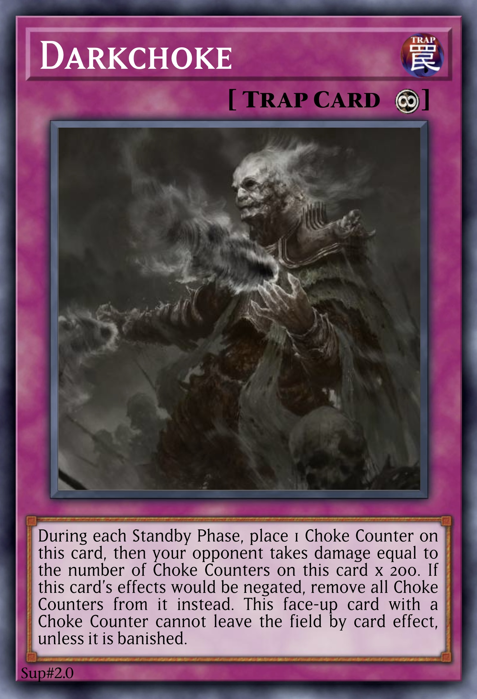

# Soul
<!-- #SQUARK live!
| dest = yugioh/archetypes/soul
| capt = Yu-Gi-Oh! Archetype
| desc = An archetype of DARK Monsters of various Types, revolving around Ritual and Synchro Summoning, with Grave effects and non-targeting soft removal.
| style = yugioh
| index = yugioh / yugioh-archetypes
| shard = #INDEX
| clean = braces
-->

An archetype of DARK Monsters of various Types, revolving around Ritual and Synchro Summoning, with Grave effects and non-targeting soft removal.

The archetype has cross-support with the [*Shadow*](Shadow.md) series.

 

## Cards

| type | count |
| :--- | :---- |
| Tuner   | x6 |
| Ritual  | x3 |
| Synchro | x10 |
| Spell   | x15 |
| Trap    | x4 |

### Monsters

Any Monsters whose Types are not specified are Psychic.

  
 <b> Main Deck </b> 
  

| card | Level | ATK/DEF | Type |
| :--- | :---- | :------ | :--- |
| [Soul Synchron](../cards/monsters/standard/Soul%20Synchron.md) | 0 | 0 / 0 | Tuner |
| [Soul Shard](../cards/monsters/standard/Soul%20Shard.md) | 1 ★ | 50 / 0 | Spirit |
| [Soul Fragment](../cards/monsters/standard/Soul%20Fragment.md) | 2 ★ | 150 / 0 | Spirit |
| [Tearful Soul](../cards/monsters/standard/Tearful%20Soul.md) | 2 ★★ | 250 / 0 | Spirit |
| [Sorrowful Soul](../cards/monsters/standard/Sorrowful%20Soul.md) | 2 ★★ | 350 / 0 | Spirit |
| [Vengeful Soul](../cards/monsters/standard/Vengeful%20Soul.md) | 3 ★★★ | 450 / 0 | Spirit |
| [Soul Demon](../cards/monsters/standard/Soul%20Demon.md) | 3 ★★★ | 750 / 0 | Fiend Spirit |
| [Soul Magician](../cards/monsters/standard/Soul%20Magician.md) | 4 ★★★★ | 1950 / 0 | Spellcaster |
| [Soul Spider](../cards/monsters/standard/Soul%20Spider.md) | 8 ★★★★★★★★ | 0 / 2850 | Insect |
| [Soul Swordsman](../cards/monsters/ritual/Soul%20Swordsman.md) | 7 ★★★★★★★ | 2750 / 0 | Warrior Ritual Tuner |
| [Soul Dragon](../cards/monsters/ritual/Soul%20Dragon.md) | 7 ★★★★★★★ | 2650 / 0 | Dragon Ritual Tuner |
| [Soul Elder](../cards/monsters/ritual/Soul%20Elder.md) | 10 ★★★★★★★★★★ | 0 / 3750 | Omega Psychic Ritual |

  
 <b> Extra Deck </b> 
  

| card | Level | ATK/DEF | Type | Material |
| :--- | :---- | :------ | :--- | :------- |
| [Soul Shard Synchron](../cards/monsters/synchro/Soul%20Shard%20Synchron.md) | ? | 0 / 0 | Synchro Tuner | *Soul Synchron* + 1+ *Soul Shard*s |
| [Soul Snake](../cards/monsters/synchro/Soul%20Snake.md) | 4 ★★★★ | 1350 / 0 | Reptile Synchro | 1 ‘Soul’ Tuner + 1+ non-Tuner ‘Soul’ Monsters |
| [Soul Alchemist](../cards/monsters/synchro/Soul%20Alchemist.md) | 5 ★★★★★ | 0 / 2350 | Spellcaster Synchro | 1 ‘Soul’ Tuner + 1+ non-Tuner ‘Soul’ Monsters |
| [Soul Knight](../cards/monsters/synchro/Soul%20Knight.md) | 6 ★★★★★★ | 1750 / 0 | Warrior Synchro | 1 ‘Soul’ Tuner + 1+ non-Tuner ‘Soul’ Monsters |
| [Soul Wanderer](../cards/monsters/synchro/Soul%20Wanderer.md) | 7 ★★★★★★★ | 2450 / 0 | Zombie Synchro | 1 ‘Soul’ Tuner + 1+ non-Tuner ‘Soul’ Monsters |
| [Soul Guardian](../cards/monsters/synchro/Soul%20Guardian.md) | 8 ★★★★★★★★ | 0 / 2950 | Synchro | 1 ‘Soul’ Tuner + 1+ non-Tuner ‘Soul’ Monsters |
| [Soul Shard Swordsman](../cards/monsters/synchro/Soul%20Shard%20Swordsman.md) | 9 ★★★★★★★★★ | 3250 / 0 | Magical Knight Synchro Tuner | *Soul Swordsman* + 1+ *Soul Shard*s |
| [Soul Shard Dragon](../cards/monsters/synchro/Soul%20Shard%20Dragon.md) | 9 ★★★★★★★★★ | 3650 / 0 | High Dragon Synchro Tuner | *Soul Dragon* + 1+ *Soul Shard*s |
| [Soul Warden](../cards/monsters/synchro/Soul%20Warden.md) | 10 ★★★★★★★★★★ | 0 / 3450 | Wyrm Synchro | 1 ‘Soul’ Ritual or Synchro Tuner + 1 ‘Soul’ Ritual or Synchro Monster |
| [Soul Slayer](../cards/monsters/synchro/Soul%20Slayer.md) | 11 ★★★★★★★★★★★ | ? / ? | Omega Psychic Synchro | 1 ‘Soul Shard’ Tuner + 1+ ‘Soul’ Ritual or Synchro Monsters |
| [Soul Assassin](../cards/monsters/synchro/Soul%20Assassin.md) | 12 ★★★★★★★★★★★★ | 2950 / 0 | Celestial Warrior Synchro | 1 ‘Soul’ Tuner + [*Shadow Assassin*](../cards/monsters/ritual/Shadow%20Assassin.md) |

### Spells

  
 <b> display </b> 
  

| card | property |
| :--- | :------- |
| [Pot of Souls](../cards/spells/Pot%20of%20Souls.md) | |
| [Soul Chasm](../cards/spells/Soul%20Chasm.md) | ✦ Field |
| [Soul Corruption](../cards/spells/Soul%20Corruption.md) | |
| [Soul Dagger](../cards/spells/Soul%20Dagger.md) | + Equip |
| [Soul Illusion](../cards/spells/Soul%20Illusion.md) | ⚡︎ Quick |
| [Soul Manifestation](../cards/spells/Soul%20Manifestation.md) | ⚡︎ Quick |
| [Soul Necropolis](../cards/spells/Soul%20Necropolis.md) | ✦ Field |
| [Soul Purity](../cards/spells/Soul%20Purity.md) | ⚡︎ Quick |
| [Soul Prophecy](../cards/spells/Soul%20Prophecy.md) | ◈ Ritual |
| [Soul Resurgence](../cards/spells/Soul%20Resurgence.md) | ⚡︎ Quick |
| [Soul Ritual](../cards/spells/Soul%20Ritual.md) | ◈ Ritual |
| [Soul Sanctuary](../cards/spells/Soul%20Sanctuary.md) | ∞ Continuous |
| [Soul Scripture](../cards/spells/Soul%20Scripture.md) | |
| [Soul Seeker](../cards/spells/Soul%20Seeker.md) | ⚡︎ Quick |
| [Soul Walker](../cards/spells/Soul%20Walker.md) | ∞ Continuous |

### Traps

  
 <b> display </b> 
  

| card | property |
| :--- | :------- |
| [Soul Fracture](../cards/traps/Soul%20Fracture.md) | |
| [Soul Rupture](../cards/traps/Soul%20Rupture.md) | |
| [Soul Scream](../cards/traps/Soul%20Scream.md) | ↵ Counter |
| [Soul Virus](../cards/traps/Soul%20Virus.md) | ∞ Continuous |

 

## Overview

*Soul* is a highly diverse archetype, with plenty of niche or flavour cards that don’t fit into a particular category. All of the Monsters have either 0 ATK or 0 DEF, with the other value ending in 50, and many of the low-Level Monsters are Spirits.

### Tuners
[Soul Synchron](../cards/standard/Soul%20Synchron.md) is the archetypal Tuner, unique in having an original Level of 0. It can, however, raise its own Level up to Lv11 by absorbing [Soul Counters](#Soul-Counters) from anywhere on the field, which allows [higher Level Synchro Monsters](#High-Level-Synchro-Monsters) to be accessed more easily. This card is vital for Synchro Summons, so can easily Special Summon itself multiple times in one turn – although *Soul* Traps tend to be in short supply.

Tuning it with [Soul Shard](#Soul-Shard) brings out [Soul Shard Synchron](../cards/synchro/Soul%20Shard%20Synchron.md), the archetypal Synchro Tuner. It is Lv0 like Soul Synchron, but is unique in that it replaces its original Level with the total Level of its Materials. It can then alter this Level by burying a non-Tuner *Soul* Monster, which also happens to be a built-in search.

<table>
  <tr>
    <th> Monster </th>
    <td align="center"> Soul Synchron </td>
    <td align="center"> Soul Shard Synchron </td>
  </tr>
  <tr>
    <th> card </th>
    <td align="center">  </td>
    <td align="center">  </td>
  </tr>
  <tr>
    <th> raises Level </th>
    <td> by removing Soul Counters from the field </td>
    <td> by burying a non-Tuner <em>Soul</em> Monster from the Deck or Extra Deck </td>
  </tr>
</table>

### Soul Shard
[Soul Shard](../cards/monsters/standard/Soul%20Shard.md) is a rather inconspicuous Monster that is key to some parts of the archetype. It unlocks access to the *Soul Shard* Synchro Monsters, [Soul Shard Synchron](#Tuners) and the [Soul Shard upgrades](#High-Level-Synchro-Monsters) of the [Lv7 Ritual Monsters](#Ritual-Monsters), all significantly more powerful than their standard counterparts. Soul Shard can easily Summon itself from the Grave, provided the player controls a high-Level *Soul* Monster. To help further, and provide a higher-Level alternative for Synchro Summons, [Soul Fragment](#Monsters) is a Lv2 Monster that can treat its name as ‘Soul Shard’, and can also easily bring itself onto the field.

<table>
  <tr>
    <th> Monster </th>
    <td align="center"> Soul Shard </td>
    <td align="center"> Soul Fragment </td>
  </tr>
  <tr>
    <th> card </th>
    <td align="center">  </td>
    <td align="center">  </td>
  </tr>
</table>

### Soulful Monsters
There are 3 other Psychic Spirit Monsters, whose name follows the form `<‘-ful’ adjective> Soul`. They don’t do too much, but are the Material needed to bring out [Vengeance Vanguard](../cards/monsters/fusion/Vengeance%20Vanguard.md).

2 of them are Lv2, with [Vengeful Soul](#Monsters) being Lv3. They share the following effects:

> Return this banished card to the Graveyard at the end of each turn. If you take damage: You can Special Summon this card from your Graveyard. If this card is banished: You can {…}. You can only use this effect of {…} once per turn.

<table>
  <tr>
    <th> Monster </th>
    <td align="center"> Tearful Soul </td>
    <td align="center"> Sorrowful Soul </td>
    <td align="center"> Vengeful Soul </td>
  </tr>
  <tr>
    <th> card </th>
    <td align="center">  </td>
    <td align="center">  </td>
    <td align="center">  </td>
  </tr>
  <tr>
    <th> banish effect </th>
    <td> bury a <em>Soul</em> Monster from Deck </td>
    <td> return a banished <em>Soul</em> card to the Grave </td>
    <td> banish a card from opponent’s Grave </td>
  </tr>
</table>

### Miscellaneous Monsters
[Soul Magician](#Monsters) is an excellent supportive Monster, and the highest Level Main Deck *Soul* Monster that can be easily Summoned. It can leverage its magical powers to recover a *Soul* Spell each turn, which helps greatly during long grind games. [Soul Demon](#Monsters) is another option to easily gather Synchro Material, and can even save games if the player has bricked or the opponent is low on LP. The archetype also has [Soul Spider](#Monsters), which can Summon itself (exclusively) from the Grave by Tributing all Monsters on the field, bypassing most immunities.

<table>
  <tr>
    <th> Monster </th>
    <td align="center"> Soul Magician </td>
    <td align="center"> Soul Demon </td>
    <td align="center"> Soul Spider </td>
  </tr>
  <tr>
    <th> card </th>
    <td align="center">  </td>
    <td align="center">  </td>
    <td align="center">  </td>
  </tr>
</table>

### Ritual Monsters
There are 2 Lv7 Ritual Monsters, [Soul Swordsman](../cards/monsters/ritual/Soul%20Swordsman.md) and [Soul Dragon](../cards/monsters/ritual/Soul%20Dragon.md), which serve as the Ritual aces of the archetype. They are quite similar, with moderate ATK, and a non-targeting soft removal trigger effect that activates whenever a *Soul* Ritual or Synchro Monster is Special Summoned (note that this doesn’t need to be a proper Ritual or Synchro Summon, or even be performed by the player themselves).

> Once per turn, if this card or another ‘Soul’ Ritual or Synchro Monster is Special Summoned: You can {…} 1 card from the field or either player’s Graveyard {…}.

They can also protect themselves from destruction by banishing a *Soul* Monster from the Grave instead.

> If this card would be destroyed, you can banish 1 ‘Soul’ Monster from your Graveyard instead.

You might have noticed these are Tuners – that’s because by tuning them with [Soul Shard](#Soul-Shard), they can evolve into their upgraded *Soul Shard* [Synchro forms](#High-Level-Synchro-Monsters), [Soul Shard Swordsman](#High-Level-Synchro-Monsters) and [Soul Shard Dragon](#High-Level-Synchro-Monsters)!

<table>
  <tr>
    <th> Monster </th>
    <td align="center"> Soul Swordsman </td>
    <td align="center"> Soul Dragon </td>
  </tr>
  <tr>
    <th> card </th>
    <td align="center">  </td>
    <td align="center">  </td>
  </tr>
  <tr>
    <th> removal </th>
    <td> return to hand </td>
    <td> shuffle into Deck </td>
  </tr>
</table>

[Soul Elder](../cards/monsters/ritual/Soul%20Elder.md) is the Lv10 Ritual boss of the archetype, with a few devastating effects. It negates the effects of all Monsters without a Level (everywhere, not just on the field), which synergises perfectly with the rest of the archetype, since it exclusively utilises Synchro Monsters (alongside the Fusion Monster [Vengeance Vanguard](../cards/monsters/fusion/Vengeance%20Vanguard)). This also doesn’t impact the [Tuners](#Tuners), since they do ‘have a Level’, only that their Level is 0.

The Monster also grants the protection effect of the [Synchro aces](#High-Level-Synchro-Monsters) to all *Soul* cards the player controls, preventing their destruction by banishing a *Soul* card from the Grave. Should a *Soul* card be banished – either through this effect, or to activate another *Soul* card’s effect, since the archetype fulfils this regularly – it can then banish an opponent’s card too.

<table>
  <tr>
    <td>  </td>
  </tr>
</table>

### Low-Level Synchro Monsters
[Soul Snake](#Monsters) is intended only to be buried from the Extra Deck, providing additional value in the Grave. Its effect that triggers upon being banished also recycles itself, as once the equipped Monster leaves the field it’ll be destroyed and sent to the Grave again, triggering its effect once more. [Soul Alchemist](#Monsters) searches out any Ritual cards necessary by burying them from the Deck – [Soul Ritual](#Ritual-Spells) can recover itself and then Ritual Summon the [Ritual Monsters](#Ritual-Monsters) from the Grave. It also gathers more Synchro Material to help with Synchro climbing.

<table>
  <tr>
    <th> Monster </th>
    <td align="center"> Soul Snake </td>
    <td align="center"> Soul Alchemist </td>
  </tr>
  <tr>
    <th> card </th>
    <td align="center">  </td>
    <td align="center">  </td>
  </tr>
</table>

### Mid-Level Synchro Monsters
[Soul Knight](#Monsters) is the signature Monster of the archetype. Despite its low original ATK, it is highly versatile – able to quickly reach very high ATK as the game develops, and even revive itself, not least being easily accessible in the first place due to its low Level.

[Soul Wanderer](#Monsters) has rather unusual effects. It provides a Spell/Trap negate either while on the field, or while in the Grave and the player controls another *Soul* Ritual or Synchro Monster. Since it is Lv7, this makes it the perfect Monster to sacrifice from the Extra Deck for [Soul Prophecy](#Ritual-Spells) to Ritual Summon [Soul Swordsman](#Ritual-Monsters) or [Soul Dragon](#Ritual-Monsters). If properly Synchro Summoned first, it can also revive itself, either for another negate or extra Material.

[Soul Guardian](#Monsters) is a defensive Monster that prevents the opponent from targeting any other *Soul* cards the player controls with card effects. Together with [Soul Warden](#High-Level-Synchro-Monsters), this grants almost absolute protection to almost all of the player’s *Soul* cards. Like many *Soul* Monsters, it can revive itself from the Grave, so can be quite difficult to deal with.

<table>
  <tr>
    <th> Monster </th>
    <td align="center"> Soul Knight </td>
    <td align="center"> Soul Wanderer </td>
    <td align="center"> Soul Guardian </td>
  </tr>
  <tr>
    <th> card </th>
    <td align="center">  </td>
    <td align="center">  </td>
    <td align="center">  </td>
  </tr>
</table>

### High-Level Synchro Monsters
[Soul Swordsman](#Ritual-Monsters) and [Soul Dragon](#Ritual-Monsters) evolve into [Soul Shard Swordsman](../cards/monsters/synchro/Soul%20Shard%20Swordsman.md) and [Soul Shard Dragon](../cards/monsters/synchro/Soul%20Shard%20Dragon.md), Lv9 Synchro Tuners with significantly higher ATK and a far more dangerous disruptive effects.

They require their Ritual counterpart and any number of *Soul Shard* Monsters as Material – which could be 2 [Soul Shard](#Soul-Shard)s, 1 [Soul Fragment](#Soul-Shard), or even a Lv2 [Soul Shard Synchron](#Tuners) – and have the condition that they must first be Synchro Summoned with exactly those Materials, preventing them from being cheated out as easily.

Inherited from their base forms, both can now protect themselves from destruction by banishing *any* *Soul* card (not just a Monster) from the Grave. They each have a quick effect that can activate by also banishing a *Soul* card from the Grave; Soul Shard Swordsman specialises in quick removal, while Soul Shard Dragon provides quick disruption and also has the highest ATK in the archetype.

<table>
  <tr>
    <th> Monster </th>
    <td align="center"> Soul Shard Swordsman </td>
    <td align="center"> Soul Shard Dragon </td>
  </tr>
  <tr>
    <th> card </th>
    <td align="center">  </td>
    <td align="center">  </td>
  </tr>
  <tr>
    <th> quick effect </th>
    <td> return 1 card from either player’s field or Grave to the hand </td>
    <td> flip all cards the opponent controls face-down </td>
  </tr>
  <tr>
    <th> other effect </th>
    <td> make opponent shuffle 1 card from their hand into the Deck when they add a card to their hand by card effect </td>
    <td> redirect an effect that targets a <em>Soul</em> card to one of the opponent’s cards </td>
  </tr>
</table>

[Soul Warden](../cards/monsters/synchro/Soul%20Warden.md) and [Soul Slayer](../cards/monsters/synchro/Soul%20Slayer.md) are the Synchro bosses of the archetype. They are both Accel Synchro Monsters, requiring *Soul* Ritual or Synchro Monsters as Material, with Soul Slayer also specifying a *Soul Shard* Tuner. Soul Warden is purely defensive, granting all of the player’s *Soul* cards (so including those not on the field) immunity to the opponent’s Monster effects that don’t target them – which includes protection from negation and floodgates. Conversely, Soul Slayer is purely offensive, quickly inflicting critical amounts of damage to the opponent to swing in for the kill.

<table>
  <tr>
    <th> Monster </th>
    <td align="center"> Soul Warden </td>
    <td align="center"> Soul Slayer </td>
  </tr>
  <tr>
    <th> card </th>
    <td align="center">  </td>
    <td align="center">  </td>
  </tr>
</table>

[Soul Assassin](../cards/monsters/synchro/Soul%20Assassin.md) is a cross-archetypal Lv12 Synchro Monster, requiring a *Soul* Tuner with [Shadow Assassin](../cards/monsters/ritual/Shadow%20Assassin.md). This is another option for OTKing the opponent, with a direct attack that cannot be stopped, that then allows it to inflict potentially massive damage. Often it will be more effective to leave the formidable Shadow Assassin on the field, but in a developed game where there are plenty of *Soul* monsters in the Grave, Soul Shard Assassin can end it before the opponent has a chance to do anything.

<table>
  <tr>
    <th> Monster </th>
    <td align="center"> Shadow Assassin</td>
    <td align="center"> Soul Assassin </td>
  </tr>
  <tr>
    <th> card </th>
    <td align="center">  </td>
    <td align="center">  </td>
  </tr>
</table>

### Ritual Spells
The archetype has 2 Ritual Spells. The standard, [Soul Ritual](../cards/spells/Soul%20Ritual.md), can Ritual Summon from either the hand and Grave, and can sacrifice in 3 ways:

- Tribute Monsters from your field (not hand)
- Banish *Soul* Synchro Monsters from your Grave
- Remove [Soul Counters](#Soul-Counters) from the field

Naturally, the most optimal method is removing Soul Counters, which results in no card advantage loss. Being able to combine all 3 gives the card great versatility in different situations. It can even recover itself whenever another Monster or *Soul* Spell/Trap is banished.

The advanced Ritual Spell [Soul Prophecy](#Spells) is more unique, Ritual Summoning from either the Deck or Grave by burying a *Soul* Synchro Monster from the Extra Deck. This essentially allows any *Soul* Ritual Monster to be turboed out for little cost, and so comes with the restriction that the player is locked out of Ritual Summoning other Monsters while that Monster remains on the field. It will also be destroyed at the end of the next turn, though all of the *Soul* Ritual Monsters can prevent this through their own protective effect.

<table>
  <tr>
    <th> Spell </th>
    <td align="center"> Soul Ritual </td>
    <td align="center"> Soul Prophecy </td>
  </tr>
  <tr>
    <th> card </th>
    <td align="center">  </td>
    <td align="center">  </td>
  </tr>
  <tr>
    <th> location </th>
    <td> hand or Grave </td>
    <td> Deck or Grave </td>
  </tr>
  <tr>
    <th> sacrifices </th>
    <td> Tribute Monsters from field, banish <em>Soul</em> Synchro Monsters from Grave, remove Soul Counters from field </td>
    <td> Send 1 <em>Soul</em> Monster from Extra Deck to Grave </td>
  </tr>
</table>

### Main Spells
There are quite a few ‘consistency’ or ‘driver’ Spells that unlock access to the rest of the archetype, both through searching cards and, more importantly, milling them.

<table>
  <tr>
    <th> Spell </th>
    <td align="center"> Scripture </td>
    <td align="center"> Pot </td>
    <td align="center"> Seeker </td>
    <td align="center"> Manifestation </td>
    <td align="center"> Resurgence </td>
  </tr>
  <tr>
    <th> card </th>
    <td align="center">  </td>
    <td align="center">  </td>
    <td align="center">  </td>
    <td align="center">  </td>
    <td align="center">  </td>
  </tr>
  <tr>
    <th> role </th>
    <td> Spell searcher </td>
    <td> drawer </td>
    <td> finder </td>
    <td> starter </td>
    <td> revival </td>
  </tr>
  <tr>
    <th> notes </th>
    <td> self-recursing, can even search itself </td>
    <td> can lead to ridiculous card advantage through both drawing *and* milling </td>
    <td> allows for more precise searching, while also milling </td>
    <td> helpful consistency boost, recovers a <em>Soul</em> Spell/Trap from the Grave </td>
    <td> helpful for comebacks or combos, recovers a banished <em>Soul</em> card </td>
  </tr>
</table>

### Lingering Spells
The archetype has 2 Field Spells, which both place Soul Counters on the field, and have a beneficial trigger effect upon being banished. [Soul Chasm](#Spells) has a crippling effect that could render boards entirely unable to battle, but since *Soul* Monsters have either 0 ATK or 0 DEF, its debuff doesn’t affect them at all. [Soul Necropolis](#Spells) protects the entire Grave and Banished Pile, allowing the archetype to activate effects there without fear of disruption from the opponent.

<table>
  <tr>
    <th> Spell </th>
    <td align="center"> Chasm </td>
    <td align="center"> Necropolis </td>
  </tr>
  <tr>
    <th> card </th>
    <td align="center">  </td>
    <td align="center">  </td>
  </tr>
  <tr>
    <th> field effect </th>
    <td> Monsters lose ATK/DEF equal to their original DEF/ATK </td>
    <td> <em>Soul</em> cards not on field are unaffected by opponent’s card effects </td>
  </tr>
  <tr>
    <th> places Soul Counters </th>
    <td> each time card is banished </td>
    <td> each time Monster is Summoned from Grave </td>
  </tr>
  <tr>
    <th> banish effect </th>
    <td> return banished <em>Soul</em> Spell/Traps to Grave </td>
    <td> return banished <em>Soul</em> Monsters to Grave </td>
  </tr>
</table>

There are also 2 Continuous Spells. [Soul Sanctuary](#Spells) is an incredible enabler that boosts ATK and searches cards, acting like many archetypal Field Spells. Since it is a Continuous Spell instead of a Field Spell, multiple copies on the field will even stack the ATK boost. [Soul Walker](#Spells) then allows the player’s *Soul* Monsters to straight up attack directly, which is very dangerous given the archetype’s ability to spam many, if weak, Monsters with ease. However, it does require the opponent to control more cards, so may not always work if the opponent has an undeveloped field.

<table>
  <tr>
    <th> Spell </th>
    <td align="center"> Sanctuary </td>
    <td align="center"> Walker </td>
  </tr>
  <tr>
    <th> card </th>
    <td align="center">  </td>
    <td align="center">  </td>
  </tr>
</table>

### Miscellaneous Spells
[Soul Corruption](#Spells) is yet more non-targeting soft removal. [Soul Illusion](#Spells) can either protect the player’s *Soul* Monsters by diverting attention away from them to itself, or in certain situations disrupt the opponent by preventing *them* from interacting with their own Monster. It’s also an easy out to any high-ATK Monster, since it can just copy that Monster’s ATK and crash into it. [Soul Dagger](#Spells) provides another way to boost ATK, as well as making an excellent self-recursing banish choice to activate the effects of other *Soul* cards.

<table>
  <tr>
    <th> Spell </th>
    <td align="center"> Corruption </td>
    <td align="center"> Illusion </td>
    <td align="center"> Dagger </td>
  </tr>
  <tr>
    <th> card </th>
    <td align="center">  </td>
    <td align="center">  </td>
    <td align="center">  </td>
  </tr>
</table>

### Trap Cards
There are only 4 *Soul* Traps, and all are fairly situational.

[Soul Rupture](#Traps) is a retaliative field nuke, that can revive a *Soul* Monster from the Grave too, but can sometimes be difficult to trigger at the right time. Oftentimes, it’s more helpful with its second effect to recover another *Soul* Spell/Trap.

[Soul Fracture](#Traps) is rather like [Waking the Dragon](). It has 2 effects, both of which can only be activated once per Duel. If it’s hard removed (destroyed or banished) by an opponent’s card effect, it can straight up cheat out any *Soul* Monster from the Extra Deck with no restrictions, like a [high-Level Synchro Monster](#High-Level-Synchro-Monster). Of course, this can be difficult to trigger, but it also has a highly dangerous Grave effect that achieves the same thing – only the Monster is destroyed later on (but remember, the [Soul Shard aces](#High-Level-Synchro-Monsters) can protect themselves from destruction).

Soul Rupture happens to synergise nicely with Soul Fracture, in that if the opponent activates an effect that would wipe the field (including backrow), chaining the Grave effect of Soul Rupture could allow Soul Fracture to be Set, and so trigger Soul Fracture’s effect without the opponent intending to.

[Soul Virus](#Traps) slowly eats away at the opponent’s Deck and Extra Deck. It contributes little to the game and barely interacts with the rest of the archetype, but can provide spare [Soul Counters](#Soul-Counters), both by itself or as another card for the [Field Spells](#Lingering-Spells) to place Soul Counters on. Most importantly, it is very difficult to remove, and becomes very damaging indeed if left for too long – before the opponent has realised it, they’ve lost several of their important cards.

[Soul Scream](#Traps) is the archetypal Counter Trap, with the power to negate *all effects* in a Chain, though like [Soul Corruption](#Miscellaneous-Spells), its cost requires setup. While this can be extremely impactful, it doesn’t discriminate between each player, so will render the entire Chain ineffective; as such, it’s most effective in response to an opponent’s [SEGOC↗](https://yugipedia.com/wiki/Simultaneous_Effects), like [Solemn Silence](../cards/traps/Solemn%20Silence.md)

<table>
  <tr>
    <th> Spell </th>
    <td align="center"> Rupture </td>
    <td align="center"> Fracture </td>
    <td align="center"> Virus </td>
    <td align="center"> Scream </td>
  </tr>
  <tr>
    <th> card </th>
    <td align="center">  </td>
    <td align="center">  </td>
    <td align="center">  </td>
    <td align="center">  </td>
  </tr>
</table>

 

## Strategy

The entire archetype revolves absolutely around the Grave. In fact, several cards and effects *only* work from the Grave – for instance, [Soul Synchron](#Tuners), [Soul Shard](#Soul-Shard), [Soul Magician](#Miscellaneous-Monsters) and the like can only Special Summon themselves from the Grave, not the hand. As such, getting a large number of cards into the Grave is vital, which the [consistency Spells](#Main-Spells) all help towards. Instead of searching cards from the Deck, the archetype tends to send them from the Deck to the Grave, and then rely on other effects to recover them from the Grave. It’s fairly roundabout, but does give the archetype great versatility in being able to recycle other cards that would otherwise be inaccessible in the Grave.

The archetype is also designed entirely to go second – since the key enablers, [Pot of Souls](#Main-Spells) and [Soul Seeker](#Main-Spells), rely exclusively on the opponent having an established field, constructing a board on the first turn without those cards is very difficult, and in many cases, essentially impossible. When going second, however, unless the opponent negates them, the opportunities these cards unlock are potentially boundless. And the more cards the opponent controls, the more effective they are – so if the opponent ends on an unstoppable board, then our counterattack will be all the more unstoppable! (Not really... there are only so many effects from the Grave, and the archetype by no means has infinite resources)

Despite its ability to swarm the field with sacrifices or Material for Ritual or Synchro Summons, the archetype likely struggles to OTK. Instead, it tends towards a more comeback-oriented playstyle, with a myriad of removal effects to deal with any ace Monsters the opponent throws.

### Combos
With such diversity, the archetype’s playstyle is highly non-linear – to encapsulate it informally, *just spam bodies and hope for the best*.

That being said, there are indeed many cards that are integral to being able to combo. Naturally, that includes [Soul Synchron](#Tuners), the only easily accessible Main Deck Tuner; [Soul Shard](#Soul-Shard), which provides spare Material and access to *Soul Shard* Monsters like [Soul Shard Synchron](#Tuners); and having [Soul Knight](#Low-Level-Synchro-Monsters) in circulation to consistently provide a body is a huge bonus.

And there are plenty of cards that help access the different parts of the archetype. [Soul Alchemist](#Low-Level-Synchro-Monsters) is fantastic for Ritual support. [Soul Scripture](#Main-Spells) is central to finding the Spells needed in any situation, though does leave the choice to the opponent. This can be circumvented by revealing 3 cards with the same name, but bear in mind this does require 3 copies of that card to be *in the Deck* – which is often not the case if 1 has been milled.

### Tech Picks

### Weaknesses
Any kind of floodgate against the Grave instantly kills the archetype. Any form of disruption against the Grave also makes life exceedingly difficult.

Other than that, the archetype’s greatest weakness is consistency. If it gets going with a healthy number of cards in the Grave, it *really* gets going, but if not, then it does struggle doing anything meaningful at all. In particular, it is noticeably reliant on the millers, [Pot of Souls](#Main-Spells) and [Soul Seeker](#Main-Spells), since although there are plenty of effects that bury specific cards from the Deck to help with consistency and combos, often what is needed is just a large pool of cards available in the Grave, whether to utilise their effects, or banish them as cost for other cards.

 

## Deck

> Last updated: June 2023

### Tips
- View the deck on [DuelingBook](https://duelingbook.com/deck?id=11423800)!
- Hover over a card to view its card text.

### Notes
- The cards are ordered in a logical order rather than by properties.
- The number of copies are not exact – they only indicate a card’s place within the deck.
- The staples provided are not exhaustive – they are only those that synergise especially well with the deck.

  
 <b> display </b> 

### Main Deck

<!--  -->

### Extra Deck

 

## Trivia

- The archetype features every type of Spell and Trap.
- It also has a Monster for every Level from 0 to 12.
- The archetype harnesses almost every type of removal effect, including:
  - Neutralising ([Soul Snake](#Low-Level-Synchro-Monsters)) – turning a Monster into a dead body by negating its attacks and effects, and preventing it from being used as Material
  - Destroying ([Soul Rupture](#Trap-Cards))
  - Sending to the Grave ([Soul Knight](#Mid-Level-Synchro-Monsters))
  - Banishing ([Soul Elder](#Ritual-Monsters))
  - Returning to the hand ([Soul Swordsman](#Ritual-Monsters), [Soul Shard Swordsman](#High-Level-Synchro-Monsters))
  - Shuffling into the Deck ([Soul Dragon](#Ritual-Monsters), [Soul Shard Swordsman](#High-Level-Synchro-Monsters))
  - Flipping face-down ([Soul Shard Dragon](#High-Level-Synchro-Monsters))
  - Taking control ([Soul Corruption](#Miscellaneous-Spells))
  - Tributing ([Soul Spider](#Miscellaneous-Monsters))
  - Banishing face-down ([Soul Virus](#Trap-Cards))
- The 0 ATK or DEF of Monsters reflects their fragility and volatility.
- [Vengeance Vanguard](../cards/monsters/fusion/Vengeance%20Vanguard.md) is the final boss of the archetype, but is not in the archetype itself.
- A significant chunk of the art is sourced from [*League of Legends*](https://wikipedia.org/wiki/League_of_Legends).
- This is one of the first custom archetypes I created.
  - It originally formed a deck called *Vengeance* with the [Ninjato](Ninjato.md) archetype, before I decided to split them so each could focus on their individual playstyle.
