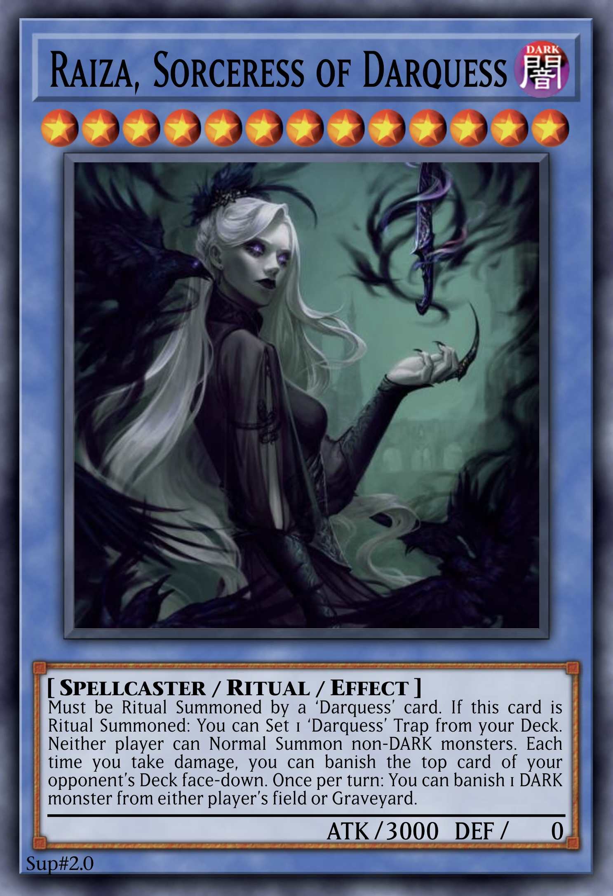

# Raiza, Sorceress of Darquess

<!-- {desc} -->

<table>
  <tr>
    <th colspan="3"> <h3> Raiza, Sorceress of Darquess </h3> </th>
  </tr>
  <tr>
    <td rowspan="8">  </td>
  </tr>
  <tr>
    <td> type </td>
    <td> Monster </td>
  </tr>
  <tr>
    <td> archetype </td>
    <td> <a href="../../../archetypes/Darquess.md">Darquess</a> </td>
  </tr>
  <tr>
    <td> Types </td>
    <td> Spellcaster / Ritual </td>
  </tr>
  <tr>
    <td> Attribute </td>
    <td> DARK </td>
  </tr>
  <tr>
    <td> Level </td>
    <td> 13 ★★★★★★★★★★★★★ </td>
  </tr>
  <tr>
    <td> ATK / DEF </td>
    <td> 3000 / 0 </td>
  </tr>
  <tr>
    <td> Ritual </td>
    <td> <a href="../../spells/Darquess Rising.md">Darquess Rising</a> </td>
  </tr>
</table>

 

## Aspects

| aspect | type | name | notes |
| :----- | :--- | :--- | :---- |
| Must be Ritual Summoned by a ‘Darquess’ card. | Summon condition | | No Drytron hacking lmao |
| If this card is Ritual Summoned: You can Set 1 ‘Darquess’ Trap from your Deck. | trigger | | |
| Neither player can Normal Summon non-DARK monsters. | continuous | | |
| Each time you take damage, you can banish the top card of your opponent’s Deck face-down. | trigger-like continuous | | |
| Once per turn: You can banish 1 DARK monster from either player’s field or Graveyard. | ignition | | The banished Monster can then be revived with [Laiza](Laiza.md). |

 

## Trivia

- This Monster’s name is the same as [Raiza the Storm Monarch](https://yugipedia.com/wiki/Raiza_the_Storm_Monarch).

 

## See Also

[Laiza, Enchantress of Darquess](../ritual/Laiza.md)  
[Vaiza, Empress of Darquess](../ritual/Vaiza.md)  
