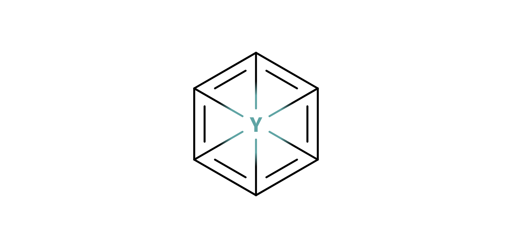
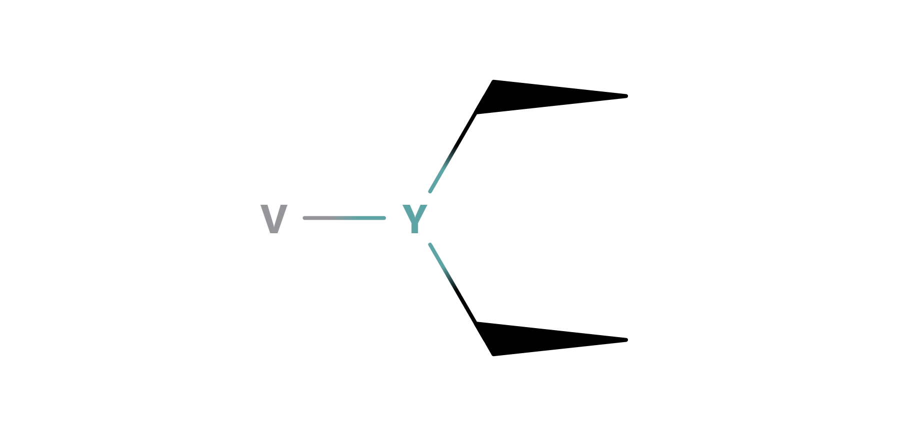
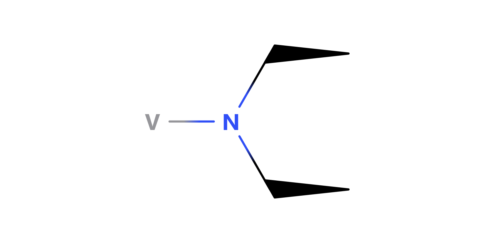
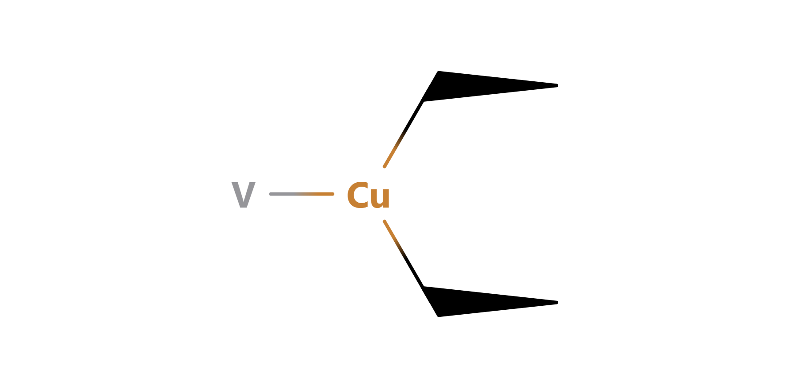

# Components

Components are the basic individual constituents of all other [structures](../structures) and compounds. They span a varity of functions, including maintaining structural integrity, powering reactions and forming weapons.

 

## Index

### Structural

<table>
  <td>
    <a href="#cell">Cell</a>  
    <a href="#bolt">Bolt</a>  
    <a href="#membrane">Membrane</a>  
    <a href="#shield">Shield</a>  
    <a href="#receptor">Receptor</a>
  </td>
</table>

### Physical Weapons

<table>
  <td>
    <a href="#spike">Spike</a>  
    <a href="#claw">Claw</a>
  </td>
</table>

### Chemical Weapons

<table>
  <td>
    <a href="#cannon">Cannon</a>  
    <a href="#turret">Turret</a>
  </td>
</table>

 

## Cell

{...}

| basic cell | resonance cell | |
| :--------: | :------------: | |
|  |  | |

| focus cell | resonance focus cell | signal focus cell |
| :--------: | :------------------: | :---------------: |
|  |  |  |

 

## Bolt

 

## Membrane

 

## Shield

{...}

| basic shield | reinforced shield |
| :----------: | :---------------: |
|  |  |

 

## Receptor

{...}

| lock | key |
| :--: | :-: |
|  |  |

 

## Spike

{...}

| basic spike |
| :---------: |
|  |

 

## Claw

{...}

| claw base | boosted claw |
| :-------: | :----------: |
|  |  |

| copper claw | iron claw |
| :---------: | :-------: |
|  |  |

 

## Cannon

{...}

| basic cannon | ranged cannon | rapid cannon |
| :----------: | :-----------: | :----------: |
|  |  |  |

 

## Turret

{...}

| turret base | charged turret | boosted turret | warp turret |
| :---------: | :------------: | :------------: | :---------: |
|  |  |  |  |
