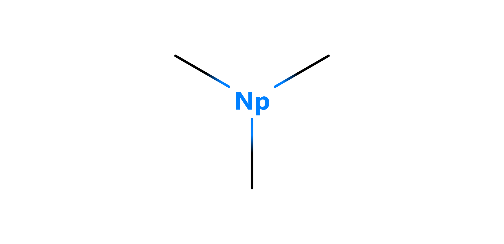

# Particles

Particles are the active weapons utilyzed by other structures.

 

## Index

<table>
  <td>
    <a href="#antibody"> Antibody </a>  
    <a href="#proton"> Proton </a>  
    <a href="#alpha"> Alpha </a>
  </td>
</table>

 

## Antibody

Antibodies are the mass soldiers, ineffective by themselves, but overwhelmingly deadly in their thousands. They have multiple points which can bond or bind to other structures, especially enemies and other antibodies, forming [antibody complexes]().

| basic antibody | charged antibody | boosted antibody |
| :------------: | :--------------: | :--------------: |
|  |  |  |

| spike antibody | signal antibody |
| :------------: | :-------------: |
|  |  |

| plus antibody | angle antibody |
| :-----------: | :------------: |
|  | 

| super antibody | mega antibody | super mega antibody |
| :------------: | :-----------: | :-----------------: |
|  |  | 

| supercharged antibody |
| :-------------------: |
| 
