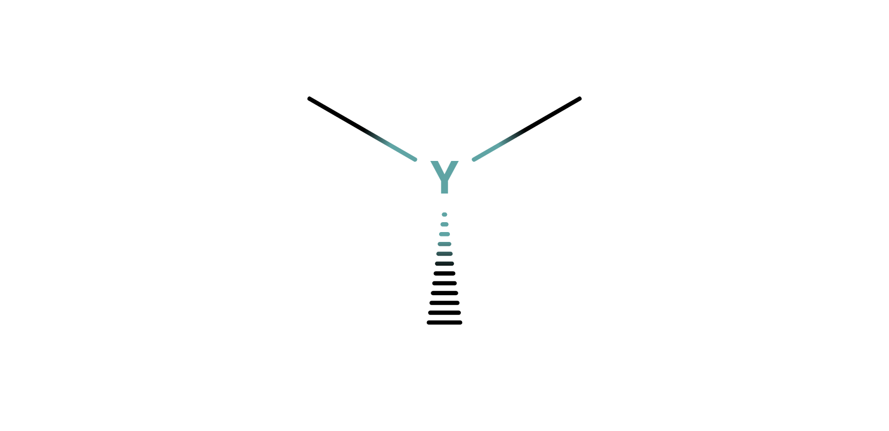

# Kenzokinetics

{desc}

 

## Index

<table>
  <td>
    <a href="#hierarchy"> Hierarchy </a>  
    <a href="#display"> Display </a>
  </td>
</table>

 

## Hierarchy

In order of ascending scale:

&emsp; [particles](particles)
&emsp; [components](components)
&emsp; [structures](structures)
&emsp; [compounds](compounds)

 

## Display

| kenzyl | katyl | kexyl |
| :----: | :---: | :---: |
|  |  |  |
| any structure   represents connection points to other structures | a generic element   N, O, P, S | a special element |
