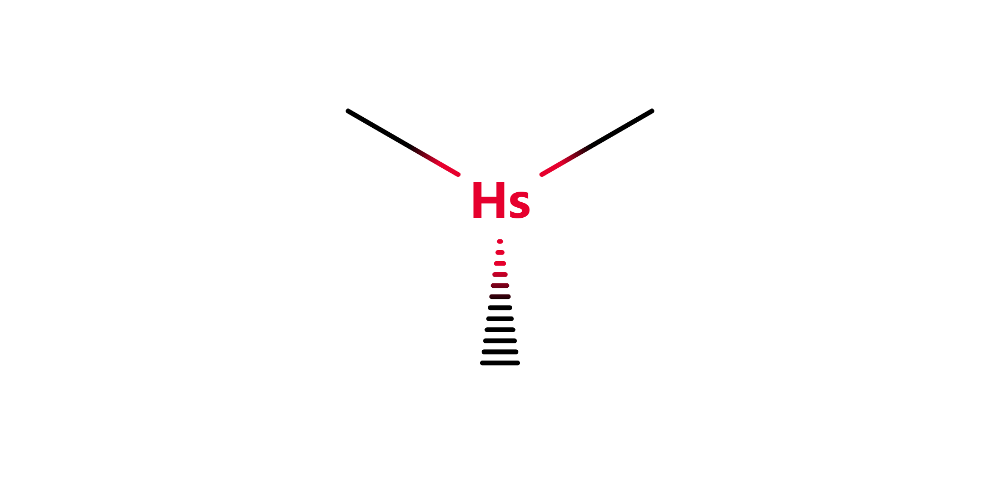

# Kenzokinetics

{desc}

 

## Index

<table>
  <td>
    <a href="#hierarchy">Hierarchy</a>  
    <a href="#display">Display</a>
  </td>
</table>

 

## Hierarchy

In order of ascending scale:

&emsp; [particles](particles)  
&emsp; [components](components)  
&emsp; [structures](structures)  
&emsp; [compounds](compounds)

 

## Display

| kenzyl | ketyl | kexyl |
| :----: | :---: | :---: |
|  |  |  |
| any structure   represents connection points to other structures | a generic element   N, O, P, S | a special element |

| core | driver | flekyl |
| :--: | :----: | :----: |
|  |  |  |
| macrostructure centre | energy source | fuel source |

| monomer | enemy | projectile |
| :-----: | :---: | :--------: |
|  |  | 

| tekyl | zekyl |
| :---: | :---: |
|  |  |
| radioactive source | intensifyzer source | 
