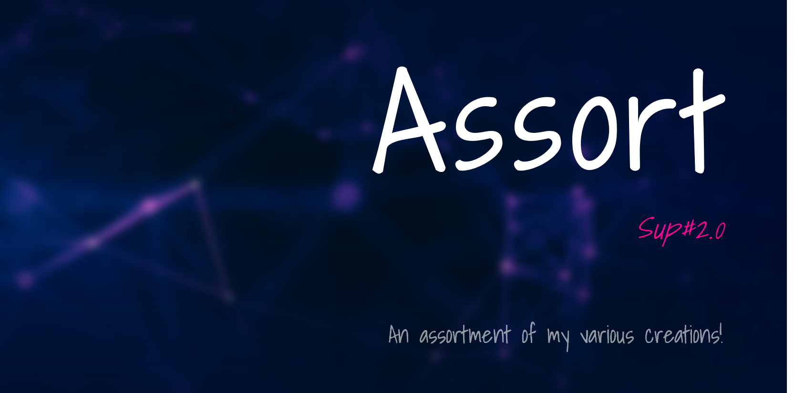

---

Feel free to have a look around!

 

## Portal

Unsure where to start?

### Folders
📁 [affine](affine)  
📁 [Yu-Gi-Oh!](Yu-Gi-Oh!)  
📁 [kenzokinetics](kenzokinetics)  
📁 [xeriqui](xeriqui)  

📁 [graphic design](~graphics)  
📁 [writing pieces](~writing)  
📁 [music](~music)  
📁 [poetry](~poetry)  

### Files
📂 [*On the Origins on Sup#2.0*](~writing/origins.md) – the lore behind Sup#2.0  
📂 [Rubic](Yu-Gi-Oh!/archetypes/Rubic.md) – a custom *Yu-Gi-Oh!* archetype  
📂 [koniokinetis](affine/affinitys/koniokinetis.md) – a fictional affinity  
📂 [Ultraman Infinity](Ultraman/Ultraman%20Infinity.md) – a fictional Ultraman  
📂 [fictional elements](Ascense/elements.md) – a list of invented elements  

 

## [Frequerys↗](https://github.com/Sup2point0/Antarctica/blob/home/readme.md#what-does-frequerys-even-mean 'frequent queries')

### What’s all this for?
I absolutely *love* creating things, and over the years I’ve created so much stuff that it’s all dispersed across multiple mediums – paper, phones, tablets, laptops, wikis – which is slightly a logistical nightmare. So, this is a repository to collect, store and archive (almost) everything I create. What exactly does that include? Well, content of any kind – documenting my ideas for games, graphic design and creative writing, lists, phenomena, worldbuilding and all. And also the fictional nation of [Antarctica↗](https://github.com/Sup2point0/Antarctica), but that’s so extensive that it’s in its own repo.

### Why use GitHub?
GitHub is absolutely perfect for this, since I can organise everything into individual folders with infinite hierarchy, and even be able to access and share it from anywhere. Y’know, say I’ve got a piece of writing I want to show a friend, I can just send them a link like [https://github.com/Sup2point0/Assort/blob/origin/~writing/creative/Expanse.md](~writing/creative/Expanse.md), and done!

### What am I even supposed to do?
Hey, first of all, thank you so much for stopping by! I don’t really create all this for others to view, but the thought of someone exploring my content with intrepid fascination fills me with an inexplicable delight. Anyway yeah, browse whatever you want – a whole lot of it is `.md` files, which GitHub will be render so that you can read, and there’ll be some images or PDF files that’ll probably be so large they exceed the size of the page. You can scroll through them, read whatever you find interesting, all up to you ^v^

### What do the folder prefixes indicate?
Uppercase and lowercase are simply stylistic choices. Those with `~` are categories, while those with `.` are developmental files you don’t need to see. (ofc, if you want, you can take a look anyway ;)

 

## Tiers

The tiers used in [favourites](~lists/favourites).

<table>
  <tr>
    <th align="left"> xeniqive </th>
    <td> <a href="">Xeniqive</a> meaning ‘heavenly’. Saved for only the best. </td>
  </tr>
  <tr>
    <th align="left"> legendary </th>
    <td> – </td>
  </tr>
  <tr>
    <th align="left"> incredible </th>
    <td> – </td>
  </tr>
  <tr>
    <th align="left"> awesome </th>
    <td> – </td>
  </tr>
  <tr>
    <th align="left"> cool </th>
    <td> No negativity here, even the lowest stuff is cool. </td>
  </tr>
</table>

 

## Spectrus

The scale of magnitude used throughout varical sections.

<table>
  <tr>
    <th align="left"> especially high </th>
    <td>  </td>
  </tr>
  <tr>
    <th align="left"> very high </th>
    <td>  </td>
  </tr>
  <tr>
    <th align="left"> high </th>
    <td>  </td>
  </tr>
  <tr>
    <th align="left"> moderative </th>
    <td>  </td>
  </tr>
  <tr>
    <th align="left"> standard </th>
    <td>  </td>
  </tr>
  <tr>
    <th align="left"> mediocre </th>
    <td>  </td>
  </tr>
  <tr>
    <th align="left"> low </th>
    <td>  </td>
  </tr>
  <tr>
    <th align="left"> very low </th>
    <td>  </td>
  </tr>
  <tr>
    <th align="left"> especially low </th>
    <td>  </td>
  </tr>
</table>

 

---

> yo, still here?
